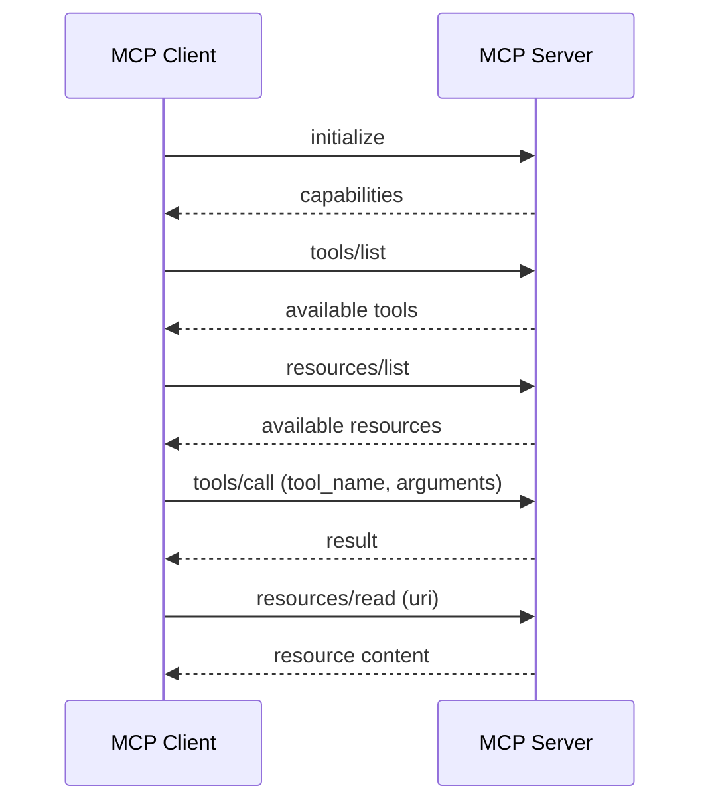
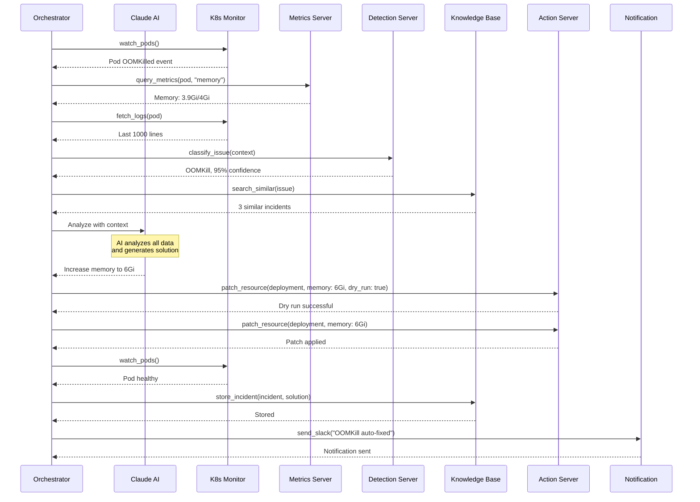

# Architecture Documentation - MCP Design

## AI-Powered Kubernetes SRE Assistant (MCP Architecture)

This document provides a comprehensive overview of the MCP-based system architecture, components, and design decisions.

---

## Table of Contents

1. [MCP Architecture Overview](#mcp-architecture-overview)
2. [MCP Servers](#mcp-servers)
3. [Communication Flow](#communication-flow)
4. [Data Models](#data-models)
5. [Technology Stack](#technology-stack)
6. [Design Patterns](#design-patterns)
7. [Scalability & Performance](#scalability--performance)
8. [Security Architecture](#security-architecture)

---

## MCP Architecture Overview

The system is built on the **Model Context Protocol (MCP)**, which provides a standardized way for AI agents to interact with external systems through specialized servers.

### High-Level Architecture

```
┌─────────────────────────────────────────────────────────────────┐
│                    MCP Client Layer                              │
│  ┌──────────────────────────────────────────────────────────┐  │
│  │              AI Agent (Claude 3.5 Sonnet)                 │  │
│  │  - Natural language understanding                         │  │
│  │  - Context-aware decision making                          │  │
│  │  - Multi-step reasoning                                   │  │
│  └──────────────────────────────────────────────────────────┘  │
│                                                                   │
│  ┌──────────────────────────────────────────────────────────┐  │
│  │                  Orchestrator                             │  │
│  │  ┌────────────┐  ┌────────────┐  ┌────────────┐         │  │
│  │  │  Workflow  │  │  Decision  │  │    MCP     │         │  │
│  │  │   Engine   │  │   Engine   │  │   Client   │         │  │
│  │  └────────────┘  └────────────┘  └────────────┘         │  │
│  └──────────────────────────────────────────────────────────┘  │
└─────────────────────────────────────────────────────────────────┘
                              ↓
                    MCP Protocol (JSON-RPC 2.0)
                              ↓
┌─────────────────────────────────────────────────────────────────┐
│                      MCP Servers Layer                           │
│                                                                   │
│  ┌──────────────────┐  ┌──────────────────┐                    │
│  │  K8s Monitor     │  │  Metrics         │                    │
│  │  MCP Server      │  │  MCP Server      │                    │
│  │                  │  │                  │                    │
│  │ • Tools          │  │ • Tools          │                    │
│  │ • Resources      │  │ • Resources      │                    │
│  │ • Prompts        │  │ • Prompts        │                    │
│  └──────────────────┘  └──────────────────┘                    │
│                                                                   │
│  ┌──────────────────┐  ┌──────────────────┐                    │
│  │  Detection       │  │  Action          │                    │
│  │  MCP Server      │  │  MCP Server      │                    │
│  │                  │  │                  │                    │
│  │ • Tools          │  │ • Tools          │                    │
│  │ • Prompts        │  │ • Resources      │                    │
│  └──────────────────┘  └──────────────────┘                    │
│                                                                   │
│  ┌──────────────────┐  ┌──────────────────┐                    │
│  │  Knowledge Base  │  │  Notification    │                    │
│  │  MCP Server      │  │  MCP Server      │                    │
│  │                  │  │                  │                    │
│  │ • Resources      │  │ • Tools          │                    │
│  │ • Tools          │  │ • Prompts        │                    │
│  └──────────────────┘  └──────────────────┘                    │
└─────────────────────────────────────────────────────────────────┘
                              ↓
┌─────────────────────────────────────────────────────────────────┐
│                  Infrastructure Layer                            │
│  ┌──────────────┐  ┌──────────────┐  ┌──────────────┐         │
│  │  Kubernetes  │  │  Prometheus  │  │  PostgreSQL  │         │
│  │   Cluster    │  │    + Loki    │  │   + Redis    │         │
│  └──────────────┘  └──────────────┘  └──────────────┘         │
└─────────────────────────────────────────────────────────────────┘
```

### Why MCP?

1. **Modularity**: Each MCP server is independent and can be developed/deployed separately
2. **Extensibility**: Easy to add new capabilities by creating new MCP servers
3. **Standardization**: Uses standard MCP protocol for all communications
4. **AI-Native**: Designed for AI agents to interact with external systems
5. **Type Safety**: Strong typing through MCP schema definitions
6. **Discoverability**: AI agents can discover available tools and resources

---

## MCP Servers

### 1. K8s Monitor MCP Server

**Purpose**: Provides real-time access to Kubernetes cluster state

#### Tools

```typescript
interface K8sMonitorTools {
  // Watch pod status changes
  watch_pods(namespace?: string, labelSelector?: string): Stream<PodEvent>
  
  // Get cluster events
  get_events(namespace?: string, fieldSelector?: string): Event[]
  
  // Fetch container logs
  fetch_logs(
    namespace: string,
    podName: string,
    container?: string,
    lines?: number
  ): string
  
  // Describe resource
  describe_resource(
    kind: string,
    namespace: string,
    name: string
  ): ResourceDescription
  
  // List resources
  list_resources(
    kind: string,
    namespace?: string,
    labelSelector?: string
  ): Resource[]
}
```

#### Resources

```typescript
interface K8sMonitorResources {
  // Pod details
  "pods://{namespace}/{pod-name}": PodResource
  
  // Cluster events
  "events://{namespace}": EventsResource
  
  // Container logs
  "logs://{namespace}/{pod-name}/{container}": LogsResource
  
  // Resource definitions
  "resources://{kind}/{namespace}/{name}": ResourceDefinition
}
```

#### Implementation

```python
# mcp-servers/k8s-monitor/server.py
from mcp.server import Server
from mcp.types import Tool, Resource
from kubernetes import client, config, watch

class K8sMonitorServer:
    def __init__(self):
        self.server = Server("k8s-monitor")
        config.load_kube_config()
        self.v1 = client.CoreV1Api()
        self.apps_v1 = client.AppsV1Api()
        
        self.register_tools()
        self.register_resources()
    
    def register_tools(self):
        @self.server.tool()
        async def watch_pods(
            namespace: str = "default",
            label_selector: str = ""
        ):
            """Watch pod status changes in real-time"""
            w = watch.Watch()
            events = []
            
            for event in w.stream(
                self.v1.list_namespaced_pod,
                namespace=namespace,
                label_selector=label_selector,
                timeout_seconds=10
            ):
                events.append({
                    "type": event["type"],
                    "pod": event["object"].metadata.name,
                    "phase": event["object"].status.phase,
                    "reason": event["object"].status.reason
                })
            
            return events
        
        @self.server.tool()
        async def fetch_logs(
            namespace: str,
            pod_name: str,
            container: str = None,
            lines: int = 1000
        ):
            """Fetch container logs"""
            return self.v1.read_namespaced_pod_log(
                name=pod_name,
                namespace=namespace,
                container=container,
                tail_lines=lines
            )
    
    def register_resources(self):
        @self.server.resource("pods://{namespace}/{pod_name}")
        async def get_pod(namespace: str, pod_name: str):
            """Get pod details"""
            pod = self.v1.read_namespaced_pod(
                name=pod_name,
                namespace=namespace
            )
            return {
                "name": pod.metadata.name,
                "namespace": pod.metadata.namespace,
                "status": pod.status.phase,
                "containers": [c.name for c in pod.spec.containers],
                "restarts": sum(
                    cs.restart_count 
                    for cs in pod.status.container_statuses or []
                )
            }
```

---

### 2. Metrics MCP Server

**Purpose**: Provides access to cluster metrics and time-series data

#### Tools

```typescript
interface MetricsTools {
  // Query Prometheus metrics
  query_metrics(
    query: string,
    time?: string
  ): MetricResult[]
  
  // Get time series data
  get_timeseries(
    metric: string,
    start: string,
    end: string,
    step?: string
  ): TimeSeries
  
  // Analyze metric trends
  analyze_trends(
    metric: string,
    duration: string
  ): TrendAnalysis
  
  // Detect anomalies
  detect_anomalies(
    metric: string,
    threshold: number
  ): Anomaly[]
}
```

#### Implementation

```python
# mcp-servers/metrics/server.py
from mcp.server import Server
from prometheus_api_client import PrometheusConnect

class MetricsServer:
    def __init__(self, prometheus_url: str):
        self.server = Server("metrics")
        self.prom = PrometheusConnect(url=prometheus_url)
        self.register_tools()
    
    def register_tools(self):
        @self.server.tool()
        async def query_metrics(query: str, time: str = None):
            """Query Prometheus metrics"""
            if time:
                result = self.prom.custom_query(query=query, params={"time": time})
            else:
                result = self.prom.custom_query(query=query)
            
            return [
                {
                    "metric": r["metric"],
                    "value": float(r["value"][1]),
                    "timestamp": r["value"][0]
                }
                for r in result
            ]
        
        @self.server.tool()
        async def get_timeseries(
            metric: str,
            start: str,
            end: str,
            step: str = "15s"
        ):
            """Get time series data"""
            result = self.prom.custom_query_range(
                query=metric,
                start_time=start,
                end_time=end,
                step=step
            )
            
            return {
                "metric": result[0]["metric"],
                "values": [
                    {"timestamp": v[0], "value": float(v[1])}
                    for v in result[0]["values"]
                ]
            }
        
        @self.server.tool()
        async def analyze_trends(metric: str, duration: str):
            """Analyze metric trends"""
            # Get recent data
            data = await self.get_timeseries(
                metric=metric,
                start=f"-{duration}",
                end="now",
                step="1m"
            )
            
            values = [v["value"] for v in data["values"]]
            
            # Calculate statistics
            mean = sum(values) / len(values)
            variance = sum((x - mean) ** 2 for x in values) / len(values)
            std_dev = variance ** 0.5
            
            # Detect trend
            if values[-1] > mean + 2 * std_dev:
                trend = "increasing"
            elif values[-1] < mean - 2 * std_dev:
                trend = "decreasing"
            else:
                trend = "stable"
            
            return {
                "metric": metric,
                "trend": trend,
                "mean": mean,
                "std_dev": std_dev,
                "current": values[-1],
                "min": min(values),
                "max": max(values)
            }
```

---

### 3. Detection MCP Server

**Purpose**: Analyzes data to detect and classify issues

#### Tools

```typescript
interface DetectionTools {
  // Detect anomalies
  detect_anomaly(
    data: MetricData,
    threshold: number
  ): AnomalyResult
  
  // Classify issue type
  classify_issue(
    context: IssueContext
  ): IssueClassification
  
  // Analyze patterns
  analyze_pattern(
    events: Event[],
    logs: string[]
  ): PatternAnalysis
  
  // Correlate events
  correlate_events(
    events: Event[],
    timeWindow: string
  ): CorrelatedEvents
}
```

#### Prompts

```typescript
interface DetectionPrompts {
  // Analyze crash patterns
  "analyze_crash": {
    arguments: {
      exitCode: number,
      logs: string[],
      events: Event[]
    }
  }
  
  // Analyze OOM kills
  "analyze_oom": {
    arguments: {
      memoryUsage: number,
      memoryLimit: number,
      trend: TrendData
    }
  }
  
  // Analyze latency issues
  "analyze_latency": {
    arguments: {
      currentLatency: number,
      baselineLatency: number,
      metrics: MetricData
    }
  }
}
```

#### Implementation

```python
# mcp-servers/detection/server.py
from mcp.server import Server
import numpy as np
from sklearn.ensemble import IsolationForest

class DetectionServer:
    def __init__(self):
        self.server = Server("detection")
        self.anomaly_detector = IsolationForest(contamination=0.1)
        self.register_tools()
        self.register_prompts()
    
    def register_tools(self):
        @self.server.tool()
        async def detect_anomaly(
            data: list[float],
            threshold: float = 2.0
        ):
            """Detect anomalies using statistical methods"""
            arr = np.array(data)
            mean = np.mean(arr)
            std = np.std(arr)
            
            anomalies = []
            for i, value in enumerate(data):
                z_score = abs((value - mean) / std)
                if z_score > threshold:
                    anomalies.append({
                        "index": i,
                        "value": value,
                        "z_score": z_score,
                        "severity": "high" if z_score > 3 else "medium"
                    })
            
            return {
                "anomalies_found": len(anomalies),
                "anomalies": anomalies,
                "baseline_mean": mean,
                "baseline_std": std
            }
        
        @self.server.tool()
        async def classify_issue(context: dict):
            """Classify issue type based on context"""
            events = context.get("events", [])
            metrics = context.get("metrics", {})
            logs = context.get("logs", [])
            
            # Check for OOMKill
            if any(e.get("reason") == "OOMKilling" for e in events):
                return {
                    "type": "OOMKill",
                    "confidence": 0.95,
                    "severity": "high",
                    "description": "Pod killed due to out of memory"
                }
            
            # Check for CrashLoopBackOff
            if any("CrashLoop" in e.get("reason", "") for e in events):
                return {
                    "type": "CrashLoop",
                    "confidence": 0.90,
                    "severity": "high",
                    "description": "Pod in crash loop"
                }
            
            # Check for high latency
            if metrics.get("p95_latency", 0) > metrics.get("baseline_latency", 0) * 2:
                return {
                    "type": "HighLatency",
                    "confidence": 0.85,
                    "severity": "medium",
                    "description": "Service latency significantly elevated"
                }
            
            return {
                "type": "Unknown",
                "confidence": 0.5,
                "severity": "low",
                "description": "Unable to classify issue"
            }
    
    def register_prompts(self):
        @self.server.prompt("analyze_crash")
        async def analyze_crash_prompt(
            exit_code: int,
            logs: list[str],
            events: list[dict]
        ):
            """Generate prompt for crash analysis"""
            return f"""Analyze this container crash:

Exit Code: {exit_code}

Recent Events:
{chr(10).join(f"- {e['type']}: {e['reason']}" for e in events)}

Last 50 Log Lines:
{chr(10).join(logs[-50:])}

Provide:
1. Root cause of the crash
2. Contributing factors
3. Recommended fixes
"""
```

---

### 4. Action MCP Server

**Purpose**: Executes remediation actions on the cluster

#### Tools

```typescript
interface ActionTools {
  // Patch Kubernetes resource
  patch_resource(
    kind: string,
    namespace: string,
    name: string,
    patch: object,
    dryRun?: boolean
  ): ActionResult
  
  // Scale workload
  scale_workload(
    kind: string,
    namespace: string,
    name: string,
    replicas: number
  ): ActionResult
  
  // Restart pod
  restart_pod(
    namespace: string,
    podName: string
  ): ActionResult
  
  // Rollback deployment
  rollback_deployment(
    namespace: string,
    name: string,
    revision?: number
  ): ActionResult
}
```

#### Implementation

```python
# mcp-servers/actions/server.py
from mcp.server import Server
from kubernetes import client, config
import json

class ActionServer:
    def __init__(self, dry_run: bool = False):
        self.server = Server("actions")
        self.dry_run = dry_run
        config.load_kube_config()
        self.v1 = client.CoreV1Api()
        self.apps_v1 = client.AppsV1Api()
        self.register_tools()
    
    def register_tools(self):
        @self.server.tool()
        async def patch_resource(
            kind: str,
            namespace: str,
            name: str,
            patch: dict,
            dry_run: bool = None
        ):
            """Patch a Kubernetes resource"""
            use_dry_run = dry_run if dry_run is not None else self.dry_run
            dry_run_param = "All" if use_dry_run else None
            
            try:
                if kind.lower() == "deployment":
                    result = self.apps_v1.patch_namespaced_deployment(
                        name=name,
                        namespace=namespace,
                        body=patch,
                        dry_run=dry_run_param
                    )
                elif kind.lower() == "pod":
                    result = self.v1.patch_namespaced_pod(
                        name=name,
                        namespace=namespace,
                        body=patch,
                        dry_run=dry_run_param
                    )
                else:
                    return {
                        "success": False,
                        "error": f"Unsupported resource kind: {kind}"
                    }
                
                return {
                    "success": True,
                    "dry_run": use_dry_run,
                    "resource": f"{kind}/{namespace}/{name}",
                    "patch_applied": patch
                }
            except Exception as e:
                return {
                    "success": False,
                    "error": str(e)
                }
        
        @self.server.tool()
        async def scale_workload(
            kind: str,
            namespace: str,
            name: str,
            replicas: int
        ):
            """Scale a workload"""
            try:
                if kind.lower() == "deployment":
                    # Get current deployment
                    deployment = self.apps_v1.read_namespaced_deployment(
                        name=name,
                        namespace=namespace
                    )
                    
                    # Update replicas
                    deployment.spec.replicas = replicas
                    
                    # Apply update
                    result = self.apps_v1.patch_namespaced_deployment_scale(
                        name=name,
                        namespace=namespace,
                        body={"spec": {"replicas": replicas}}
                    )
                    
                    return {
                        "success": True,
                        "resource": f"{kind}/{namespace}/{name}",
                        "replicas": replicas
                    }
                else:
                    return {
                        "success": False,
                        "error": f"Scaling not supported for {kind}"
                    }
            except Exception as e:
                return {
                    "success": False,
                    "error": str(e)
                }
```

---

### 5. Knowledge Base MCP Server

**Purpose**: Stores and retrieves historical incident data

#### Resources

```typescript
interface KnowledgeBaseResources {
  // Historical incidents
  "incidents://": IncidentList
  "incidents://{id}": Incident
  
  // Known solutions
  "solutions://": SolutionList
  "solutions://{id}": Solution
  
  // Issue patterns
  "patterns://": PatternList
  "patterns://{type}": Pattern
}
```

#### Tools

```typescript
interface KnowledgeBaseTools {
  // Search similar incidents
  search_similar(
    issue: IssueDescription,
    limit?: number
  ): Incident[]
  
  // Store incident
  store_incident(
    incident: Incident,
    solution: Solution
  ): StorageResult
  
  // Get solution
  get_solution(
    issueType: string,
    context: object
  ): Solution
  
  // Update effectiveness
  update_effectiveness(
    solutionId: string,
    success: boolean
  ): UpdateResult
}
```

#### Implementation

```python
# mcp-servers/knowledge-base/server.py
from mcp.server import Server
import chromadb
from datetime import datetime

class KnowledgeBaseServer:
    def __init__(self, db_url: str):
        self.server = Server("knowledge-base")
        self.chroma = chromadb.Client()
        self.collection = self.chroma.create_collection("incidents")
        self.register_resources()
        self.register_tools()
    
    def register_tools(self):
        @self.server.tool()
        async def search_similar(
            issue: dict,
            limit: int = 5
        ):
            """Search for similar incidents"""
            # Create query from issue description
            query_text = f"{issue['type']} {issue['description']}"
            
            # Search in vector database
            results = self.collection.query(
                query_texts=[query_text],
                n_results=limit
            )
            
            return [
                {
                    "id": results["ids"][0][i],
                    "incident": results["documents"][0][i],
                    "similarity": results["distances"][0][i],
                    "metadata": results["metadatas"][0][i]
                }
                for i in range(len(results["ids"][0]))
            ]
        
        @self.server.tool()
        async def store_incident(
            incident: dict,
            solution: dict
        ):
            """Store incident and solution"""
            # Create document
            doc_text = f"""
            Type: {incident['type']}
            Description: {incident['description']}
            Root Cause: {incident['root_cause']}
            Solution: {solution['description']}
            """
            
            # Store in vector database
            self.collection.add(
                documents=[doc_text],
                metadatas=[{
                    "type": incident["type"],
                    "severity": incident["severity"],
                    "solution_id": solution["id"],
                    "success": solution.get("success", True),
                    "timestamp": datetime.now().isoformat()
                }],
                ids=[incident["id"]]
            )
            
            return {
                "success": True,
                "incident_id": incident["id"]
            }
```

---

### 6. Notification MCP Server

**Purpose**: Sends notifications to various channels

#### Tools

```typescript
interface NotificationTools {
  // Send Slack notification
  send_slack(
    message: string,
    channel?: string,
    severity?: string
  ): NotificationResult
  
  // Send email
  send_email(
    to: string[],
    subject: string,
    body: string
  ): NotificationResult
  
  // Create ticket
  create_ticket(
    title: string,
    description: string,
    priority: string
  ): TicketResult
  
  // Send webhook
  send_webhook(
    url: string,
    payload: object
  ): WebhookResult
}
```

---

## Communication Flow

### MCP Protocol Flow



### End-to-End Issue Resolution



---

## Data Models

### MCP Message Format

```typescript
// Tool Call
interface ToolCall {
  jsonrpc: "2.0"
  id: string | number
  method: "tools/call"
  params: {
    name: string
    arguments: Record<string, unknown>
  }
}

// Tool Response
interface ToolResponse {
  jsonrpc: "2.0"
  id: string | number
  result: {
    content: Array<{
      type: "text" | "image" | "resource"
      text?: string
      data?: string
      uri?: string
    }>
  }
}

// Resource Read
interface ResourceRead {
  jsonrpc: "2.0"
  id: string | number
  method: "resources/read"
  params: {
    uri: string
  }
}
```

### Domain Models

```typescript
interface Incident {
  id: string
  type: string
  namespace: string
  podName: string
  severity: "low" | "medium" | "high" | "critical"
  detectedAt: string
  resolvedAt?: string
  rootCause: string
  solution?: Solution
  autoFixed: boolean
  confidence: number
}

interface Solution {
  id: string
  description: string
  actions: Action[]
  confidence: number
  riskLevel: "low" | "medium" | "high"
  rollbackProcedure: Action[]
  validationChecks: string[]
}

interface Action {
  type: string
  target: string
  parameters: Record<string, unknown>
  dryRun: boolean
}
```

---

## Technology Stack

### MCP Infrastructure
- **MCP SDK**: Python (`mcp` package) or TypeScript (`@modelcontextprotocol/sdk`)
- **Transport**: stdio (local), SSE (HTTP), WebSocket (real-time)
- **Protocol**: JSON-RPC 2.0
- **Serialization**: JSON

### AI/ML
- **LLM**: Claude 3.5 Sonnet (Anthropic)
- **Embeddings**: OpenAI text-embedding-3-small
- **Vector DB**: ChromaDB or Pinecone
- **ML Libraries**: scikit-learn, numpy

### Backend
- **MCP Servers**: Python 3.11+ with FastMCP
- **Orchestrator**: Python with asyncio
- **API**: FastAPI (optional REST interface)

### Infrastructure
- **Kubernetes**: client-go (Go) or kubernetes-python
- **Monitoring**: Prometheus, Loki, Grafana
- **Database**: PostgreSQL 15+, Redis 7+
- **Storage**: S3-compatible (MinIO)

---

## Design Patterns

### 1. MCP Server Pattern
Each server is independent and follows MCP specification:
- Exposes tools, resources, and prompts
- Handles initialization and capability negotiation
- Implements error handling and logging

### 2. Orchestrator Pattern
Central orchestrator coordinates between MCP servers:
- Manages workflow execution
- Makes decisions based on AI analysis
- Handles error recovery

### 3. Event-Driven Pattern
System reacts to cluster events:
- Kubernetes events trigger workflows
- Metrics anomalies trigger analysis
- Actions trigger validation

### 4. Circuit Breaker Pattern
Prevents cascading failures:
- Tracks action success/failure rates
- Opens circuit after threshold failures
- Gradually recovers with half-open state

---

## Scalability & Performance

### Horizontal Scaling
- **MCP Servers**: Stateless, can run multiple instances
- **Orchestrator**: Single active with standby for HA
- **Load Balancing**: Round-robin across server instances

### Performance Optimizations
- **Caching**: Redis for frequently accessed data
- **Batching**: Batch similar operations
- **Async I/O**: Non-blocking operations throughout
- **Connection Pooling**: Reuse connections to K8s API

### Resource Requirements
```yaml
MCP Servers (each):
  CPU: 200m - 500m
  Memory: 256Mi - 512Mi
  Replicas: 2-3

Orchestrator:
  CPU: 500m - 1 core
  Memory: 512Mi - 1Gi
  Replicas: 1 (active) + 1 (standby)
```

---

## Security Architecture

### MCP Security
- **Transport Security**: TLS for remote connections
- **Authentication**: Token-based auth for MCP servers
- **Authorization**: Role-based access control
- **Audit**: All tool calls logged

### Kubernetes Security
- **RBAC**: Minimal permissions per server
- **Service Accounts**: Dedicated SA for each server
- **Network Policies**: Restrict inter-pod communication
- **Secrets**: Encrypted at rest and in transit

### AI Security
- **Prompt Injection**: Input validation and sanitization
- **Output Validation**: Verify AI-generated actions
- **Rate Limiting**: Prevent abuse of AI APIs
- **Audit Trail**: Log all AI decisions

---

## Conclusion

The MCP-based architecture provides a modular, extensible, and AI-native design for the Kubernetes SRE assistant. The use of standardized MCP protocol enables:

- Easy addition of new capabilities
- Clear separation of concerns
- Type-safe interactions
- AI agent discoverability
- Production-ready reliability

This architecture is designed to scale from small clusters to large enterprise deployments while maintaining simplicity and maintainability.