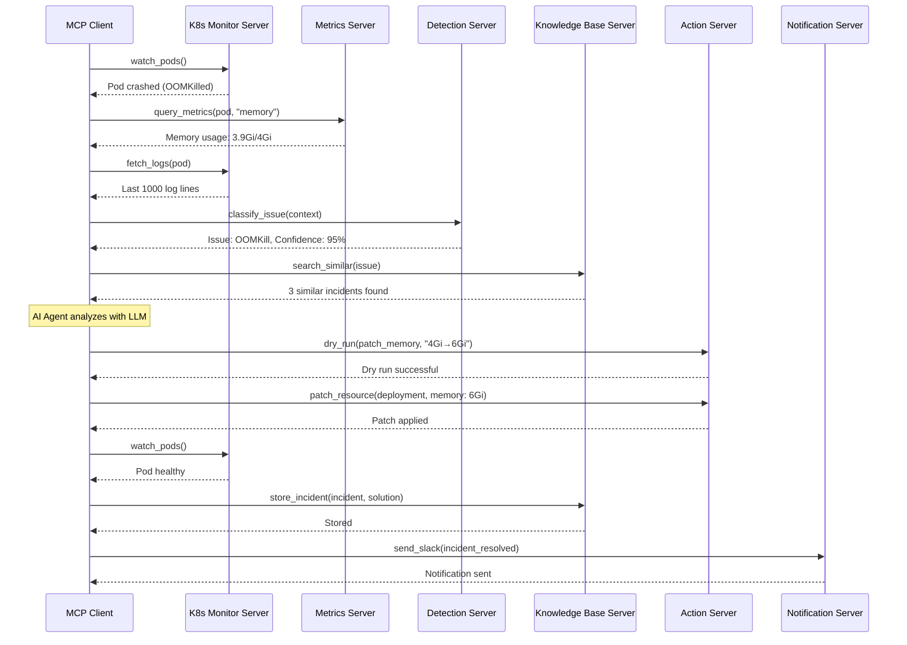

# AI-Powered Kubernetes SRE Assistant (MCP Architecture)

An intelligent, autonomous Site Reliability Engineering (SRE) assistant built on **Model Context Protocol (MCP)** that monitors your Kubernetes cluster, detects issues, explains root causes, and automatically applies fixes.

## 🎯 Overview

This AI-powered SRE assistant leverages the **Model Context Protocol (MCP)** to provide a modular, extensible architecture where specialized MCP servers handle different aspects of cluster monitoring and remediation.

### Key Features

- **MCP-Based Architecture**: Modular design using MCP servers for extensibility
- **Continuous Monitoring**: Watches cluster health via dedicated MCP servers
- **Intelligent Detection**: AI-powered issue detection through MCP tools
- **Root Cause Analysis**: LLM-based analysis using MCP context
- **Automated Remediation**: Safe auto-fixes with MCP action servers
- **Learning System**: Continuous improvement through MCP knowledge servers

## 🏗️ MCP Architecture

```
┌─────────────────────────────────────────────────────────────────┐
│                     MCP Client (Orchestrator)                    │
│                                                                   │
│  ┌──────────────┐  ┌──────────────┐  ┌──────────────┐          │
│  │   AI Agent   │  │  Workflow    │  │   Decision   │          │
│  │   (Claude)   │  │   Engine     │  │    Engine    │          │
│  └──────────────┘  └──────────────┘  └──────────────┘          │
└─────────────────────────────────────────────────────────────────┘
                              ↓ MCP Protocol
┌─────────────────────────────────────────────────────────────────┐
│                        MCP Servers Layer                         │
│                                                                   │
│  ┌──────────────────┐  ┌──────────────────┐                    │
│  │  K8s Monitor     │  │  Metrics Server  │                    │
│  │  MCP Server      │  │  MCP Server      │                    │
│  │                  │  │                  │                    │
│  │ Tools:           │  │ Tools:           │                    │
│  │ - watch_pods     │  │ - query_metrics  │                    │
│  │ - get_events     │  │ - get_timeseries │                    │
│  │ - fetch_logs     │  │ - analyze_trends │                    │
│  └──────────────────┘  └──────────────────┘                    │
│                                                                   │
│  ┌──────────────────┐  ┌──────────────────┐                    │
│  │  Detection       │  │  Action          │                    │
│  │  MCP Server      │  │  MCP Server      │                    │
│  │                  │  │                  │                    │
│  │ Tools:           │  │ Tools:           │                    │
│  │ - detect_anomaly │  │ - patch_resource │                    │
│  │ - classify_issue │  │ - scale_workload │                    │
│  │ - analyze_pattern│  │ - restart_pod    │                    │
│  └──────────────────┘  └──────────────────┘                    │
│                                                                   │
│  ┌──────────────────┐  ┌──────────────────┐                    │
│  │  Knowledge Base  │  │  Notification    │                    │
│  │  MCP Server      │  │  MCP Server      │                    │
│  │                  │  │                  │                    │
│  │ Resources:       │  │ Tools:           │                    │
│  │ - incidents      │  │ - send_slack     │                    │
│  │ - solutions      │  │ - send_email     │                    │
│  │ - patterns       │  │ - create_ticket  │                    │
│  └──────────────────┘  └──────────────────┘                    │
└─────────────────────────────────────────────────────────────────┘
                              ↓
┌─────────────────────────────────────────────────────────────────┐
│                    Kubernetes Cluster                            │
└─────────────────────────────────────────────────────────────────┘
```

## 🚀 MCP Servers

### 1. K8s Monitor MCP Server
**Purpose**: Provides real-time access to Kubernetes cluster state

**Tools**:
- `watch_pods`: Stream pod status changes
- `get_events`: Retrieve cluster events
- `fetch_logs`: Get container logs
- `describe_resource`: Get detailed resource information

**Resources**:
- `pods://namespace/pod-name`: Pod details
- `events://namespace`: Cluster events
- `logs://namespace/pod-name/container`: Container logs

### 2. Metrics MCP Server
**Purpose**: Provides access to cluster metrics and time-series data

**Tools**:
- `query_metrics`: Query Prometheus metrics
- `get_timeseries`: Get metric time series
- `analyze_trends`: Analyze metric trends
- `detect_anomalies`: Statistical anomaly detection

**Resources**:
- `metrics://pod/memory`: Memory metrics
- `metrics://pod/cpu`: CPU metrics
- `metrics://service/latency`: Latency metrics

### 3. Detection MCP Server
**Purpose**: Analyzes data to detect and classify issues

**Tools**:
- `detect_anomaly`: Detect anomalous behavior
- `classify_issue`: Classify issue type
- `analyze_pattern`: Pattern recognition
- `correlate_events`: Correlate related events

**Prompts**:
- `analyze_crash`: Analyze crash patterns
- `analyze_oom`: Analyze OOM kills
- `analyze_latency`: Analyze latency issues

### 4. Action MCP Server
**Purpose**: Executes remediation actions on the cluster

**Tools**:
- `patch_resource`: Update Kubernetes resources
- `scale_workload`: Scale deployments/statefulsets
- `restart_pod`: Restart pods
- `rollback_deployment`: Rollback to previous version
- `dry_run`: Test action without applying

### 5. Knowledge Base MCP Server
**Purpose**: Stores and retrieves historical incident data

**Resources**:
- `incidents://`: Historical incidents
- `solutions://`: Known solutions
- `patterns://`: Issue patterns

**Tools**:
- `search_similar`: Find similar incidents
- `store_incident`: Store new incident
- `get_solution`: Retrieve solution
- `update_effectiveness`: Update solution effectiveness

### 6. Notification MCP Server
**Purpose**: Sends notifications to various channels

**Tools**:
- `send_slack`: Send Slack notification
- `send_email`: Send email alert
- `create_ticket`: Create PagerDuty/Jira ticket
- `send_webhook`: Send custom webhook

## 📊 MCP Workflow

### Issue Detection & Resolution Flow



## 🛠️ Technology Stack

### MCP Infrastructure
- **MCP SDK**: Python/TypeScript MCP SDK
- **Transport**: stdio, SSE, or WebSocket
- **Protocol**: JSON-RPC 2.0

### Backend Services
- **MCP Servers**: Python (FastMCP) or TypeScript
- **Orchestrator**: Python with Claude API
- **Database**: PostgreSQL + Vector DB (Chroma/Pinecone)
- **Cache**: Redis

### Kubernetes Integration
- **Client**: kubernetes-python / client-go
- **Monitoring**: Prometheus, Loki
- **Metrics**: kube-state-metrics

### AI/ML
- **LLM**: Claude 3.5 Sonnet (via MCP)
- **Embeddings**: OpenAI embeddings
- **Vector Search**: ChromaDB

## 📁 Project Structure

```
k8s-assistant-mcp/
├── README.md
├── ARCHITECTURE.md
├── mcp-servers/
│   ├── k8s-monitor/
│   │   ├── server.py
│   │   ├── tools.py
│   │   └── resources.py
│   ├── metrics/
│   │   ├── server.py
│   │   └── tools.py
│   ├── detection/
│   │   ├── server.py
│   │   ├── tools.py
│   │   └── prompts.py
│   ├── actions/
│   │   ├── server.py
│   │   └── tools.py
│   ├── knowledge-base/
│   │   ├── server.py
│   │   ├── resources.py
│   │   └── tools.py
│   └── notifications/
│       ├── server.py
│       └── tools.py
├── orchestrator/
│   ├── main.py
│   ├── workflow_engine.py
│   ├── decision_engine.py
│   └── mcp_client.py
├── config/
│   ├── mcp-servers.json
│   ├── config.yaml
│   └── prompts/
├── charts/
│   └── k8s-assistant-mcp/
├── docs/
│   ├── mcp-servers/
│   ├── api/
│   ├── configuration/
│   └── examples/
└── tests/
```

## 🚦 Quick Start

> **📖 For detailed installation instructions, see [INSTALL.md](INSTALL.md)**

### Prerequisites
- Kubernetes cluster (1.28+)
- Python 3.11+
- Claude API key or OpenAI API key
- kubectl configured

### Quick Installation

1. **Clone Repository**
```bash
git clone https://github.com/your-org/k8s-assistant-mcp.git
cd k8s-assistant-mcp
```

2. **Install Dependencies**
```bash
# Install all dependencies
pip install -r requirements.txt
```

3. **Set Environment Variables**
```bash
# Set your API key
export ANTHROPIC_API_KEY="your-api-key-here"
# OR
export OPENAI_API_KEY="your-api-key-here"

# Set kubeconfig (if not default)
export KUBECONFIG=~/.kube/config
```

4. **Configure MCP Servers**
```bash
cp config/mcp-servers.example.json config/mcp-servers.json
# Edit with your settings
```

4. **Start MCP Servers**
```bash
# Start all MCP servers
./scripts/start-mcp-servers.sh

# Or start individually
python mcp-servers/k8s-monitor/server.py
python mcp-servers/metrics/server.py
python mcp-servers/detection/server.py
python mcp-servers/actions/server.py
python mcp-servers/knowledge-base/server.py
python mcp-servers/notifications/server.py
```

5. **Start Orchestrator**
```bash
python orchestrator/main.py
```

### MCP Server Configuration

```json
{
  "mcpServers": {
    "k8s-monitor": {
      "command": "python",
      "args": ["mcp-servers/k8s-monitor/server.py"],
      "env": {
        "KUBECONFIG": "/path/to/kubeconfig"
      }
    },
    "metrics": {
      "command": "python",
      "args": ["mcp-servers/metrics/server.py"],
      "env": {
        "PROMETHEUS_URL": "http://prometheus:9090"
      }
    },
    "detection": {
      "command": "python",
      "args": ["mcp-servers/detection/server.py"]
    },
    "actions": {
      "command": "python",
      "args": ["mcp-servers/actions/server.py"],
      "env": {
        "KUBECONFIG": "/path/to/kubeconfig",
        "DRY_RUN": "false"
      }
    },
    "knowledge-base": {
      "command": "python",
      "args": ["mcp-servers/knowledge-base/server.py"],
      "env": {
        "DATABASE_URL": "postgresql://localhost/k8s_assistant"
      }
    },
    "notifications": {
      "command": "python",
      "args": ["mcp-servers/notifications/server.py"],
      "env": {
        "SLACK_WEBHOOK": "https://hooks.slack.com/..."
      }
    }
  }
}
```

## 🎯 Use Cases

### Scenario 1: OOMKill Auto-Remediation

```python
# The MCP orchestrator handles this automatically:

# 1. K8s Monitor detects OOMKill event
event = await k8s_monitor.watch_pods()

# 2. Metrics Server provides memory data
metrics = await metrics_server.query_metrics(pod, "memory")

# 3. Detection Server classifies issue
issue = await detection_server.classify_issue(event, metrics)

# 4. Knowledge Base finds similar incidents
similar = await kb_server.search_similar(issue)

# 5. AI Agent (Claude) analyzes and decides
analysis = await claude.analyze(issue, metrics, similar)

# 6. Action Server applies fix
result = await action_server.patch_resource(
    deployment, 
    {"memory": "6Gi"}
)

# 7. Notification Server alerts team
await notify_server.send_slack(f"Auto-fixed OOMKill: {result}")
```

## 🔒 Security

- **MCP Transport Security**: TLS for remote connections
- **Authentication**: Token-based auth for MCP servers
- **RBAC**: Kubernetes RBAC for cluster access
- **Secrets**: Encrypted storage for API keys
- **Audit**: All actions logged

## 📊 Monitoring

- **MCP Server Health**: Health checks for all servers
- **Tool Usage Metrics**: Track tool invocations
- **Performance**: Latency and throughput metrics
- **Errors**: Error rates and types

## 🤝 Contributing

See [CONTRIBUTORS.md](CONTRIBUTORS.md) for contribution guidelines.

## 📄 License

MIT License - see [LICENSE](LICENSE) file

## 📞 Support

- **Documentation**: [docs/](docs/)
- **Issues**: [GitHub Issues](https://github.com/your-org/k8s-assistant-mcp/issues)
- **Discussions**: [GitHub Discussions](https://github.com/your-org/k8s-assistant-mcp/discussions)

---

**Built with ❤️ using Model Context Protocol (MCP)**