# Workflow Documentation - MCP Architecture

## AI-Powered Kubernetes SRE Assistant (MCP)

This document provides detailed workflow diagrams and explanations for all major processes in the MCP-based system.

---

## Table of Contents

1. [Overview](#overview)
2. [MCP Architecture Workflows](#mcp-architecture-workflows)
3. [Complete End-to-End Workflow](#complete-end-to-end-workflow)
4. [MCP Server Interaction Workflows](#mcp-server-interaction-workflows)
5. [Issue Detection Workflow](#issue-detection-workflow)
6. [AI Analysis Workflow](#ai-analysis-workflow)
7. [Decision & Action Workflow](#decision--action-workflow)
8. [Validation & Rollback Workflow](#validation--rollback-workflow)
9. [Learning & Feedback Workflow](#learning--feedback-workflow)
10. [Specific Issue Workflows](#specific-issue-workflows)

---

## Overview

The AI-Powered Kubernetes SRE Assistant operates through a series of interconnected workflows using the **Model Context Protocol (MCP)** architecture. Each MCP server provides specialized capabilities through tools, resources, and prompts.

### Workflow Principles

1. **MCP-Native**: All interactions use MCP protocol (JSON-RPC 2.0)
2. **Tool-Based**: Operations performed through MCP tool calls
3. **Resource-Driven**: Data accessed via MCP resources
4. **AI-Orchestrated**: Claude AI agent coordinates all MCP servers
5. **Event-Driven**: Reacts to cluster events in real-time
6. **Asynchronous**: Non-blocking operations for scalability
7. **Observable**: Every step is logged and monitored
8. **Reversible**: All actions can be rolled back

---

## MCP Architecture Workflows

### MCP Protocol Communication Flow

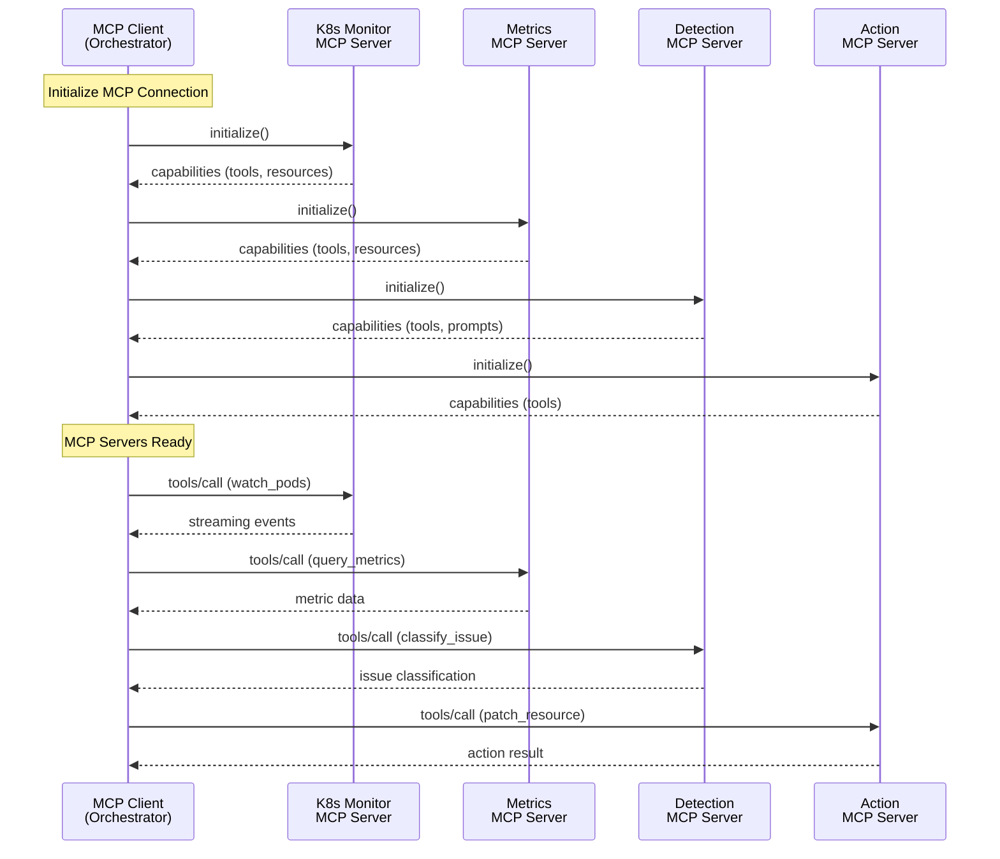
```mermaid
sequenceDiagram
    participant Client as MCP Client<br/>(Orchestrator)
    participant K8s as K8s Monitor<br/>MCP Server
    participant Metrics as Metrics<br/>MCP Server
    participant Detect as Detection<br/>MCP Server
    participant Action as Action<br/>MCP Server
    
    Note over Client: Initialize MCP Connection
    Client->>K8s: initialize()
    K8s-->>Client: capabilities (tools, resources)
    
    Client->>Metrics: initialize()
    Metrics-->>Client: capabilities (tools, resources)
    
    Client->>Detect: initialize()
    Detect-->>Client: capabilities (tools, prompts)
    
    Client->>Action: initialize()
    Action-->>Client: capabilities (tools)
    
    Note over Client: MCP Servers Ready
    
    Client->>K8s: tools/call (watch_pods)
    K8s-->>Client: streaming events
    
    Client->>Metrics: tools/call (query_metrics)
    Metrics-->>Client: metric data
    
    Client->>Detect: tools/call (classify_issue)
    Detect-->>Client: issue classification
    
    Client->>Action: tools/call (patch_resource)
    Action-->>Client: action result
```

### MCP Server Discovery & Initialization

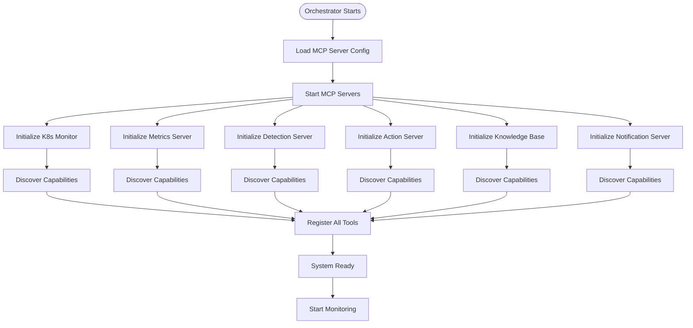
```mermaid
flowchart TD
    Start([Orchestrator Starts]) --> LoadConfig[Load MCP Server Config]
    LoadConfig --> StartServers[Start MCP Servers]
    
    StartServers --> K8sInit[Initialize K8s Monitor]
    StartServers --> MetricsInit[Initialize Metrics Server]
    StartServers --> DetectInit[Initialize Detection Server]
    StartServers --> ActionInit[Initialize Action Server]
    StartServers --> KBInit[Initialize Knowledge Base]
    StartServers --> NotifyInit[Initialize Notification Server]
    
    K8sInit --> K8sCap[Discover Capabilities]
    MetricsInit --> MetricsCap[Discover Capabilities]
    DetectInit --> DetectCap[Discover Capabilities]
    ActionInit --> ActionCap[Discover Capabilities]
    KBInit --> KBCap[Discover Capabilities]
    NotifyInit --> NotifyCap[Discover Capabilities]
    
    K8sCap --> Register[Register All Tools]
    MetricsCap --> Register
    DetectCap --> Register
    ActionCap --> Register
    KBCap --> Register
    NotifyCap --> Register
    
    Register --> Ready[System Ready]
    Ready --> Monitor[Start Monitoring]
```

---

## Complete End-to-End Workflow

### High-Level MCP Flow Diagram

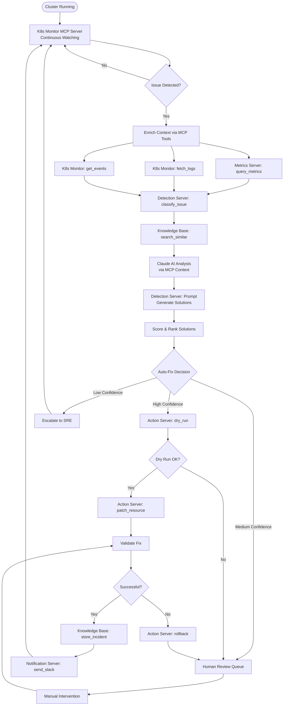
```mermaid
graph TB
    Start([Cluster Running]) --> Monitor[K8s Monitor MCP Server<br/>Continuous Watching]
    Monitor --> Detect{Issue Detected?}
    Detect -->|No| Monitor
    Detect -->|Yes| Enrich[Enrich Context via MCP Tools]
    
    Enrich --> CallMetrics[Metrics Server: query_metrics]
    Enrich --> CallLogs[K8s Monitor: fetch_logs]
    Enrich --> CallEvents[K8s Monitor: get_events]
    
    CallMetrics --> Classify[Detection Server: classify_issue]
    CallLogs --> Classify
    CallEvents --> Classify
    
    Classify --> SearchKB[Knowledge Base: search_similar]
    SearchKB --> AIAnalysis[Claude AI Analysis<br/>via MCP Context]
    
    AIAnalysis --> Generate[Detection Server: Prompt<br/>Generate Solutions]
    Generate --> Score[Score & Rank Solutions]
    
    Score --> Decide{Auto-Fix Decision}
    Decide -->|High Confidence| DryRun[Action Server: dry_run]
    Decide -->|Medium Confidence| Review[Human Review Queue]
    Decide -->|Low Confidence| Escalate[Escalate to SRE]
    
    DryRun --> Success{Dry Run OK?}
    Success -->|Yes| AutoFix[Action Server: patch_resource]
    Success -->|No| Review
    
    AutoFix --> Validate[Validate Fix]
    Review --> Manual[Manual Intervention]
    Manual --> Validate
    
    Validate --> ValidSuccess{Successful?}
    ValidSuccess -->|Yes| StoreKB[Knowledge Base: store_incident]
    ValidSuccess -->|No| Rollback[Action Server: rollback]
    
    Rollback --> Review
    StoreKB --> Notify[Notification Server: send_slack]
    Notify --> Monitor
    Escalate --> Monitor
```

### Detailed MCP Sequence Diagram

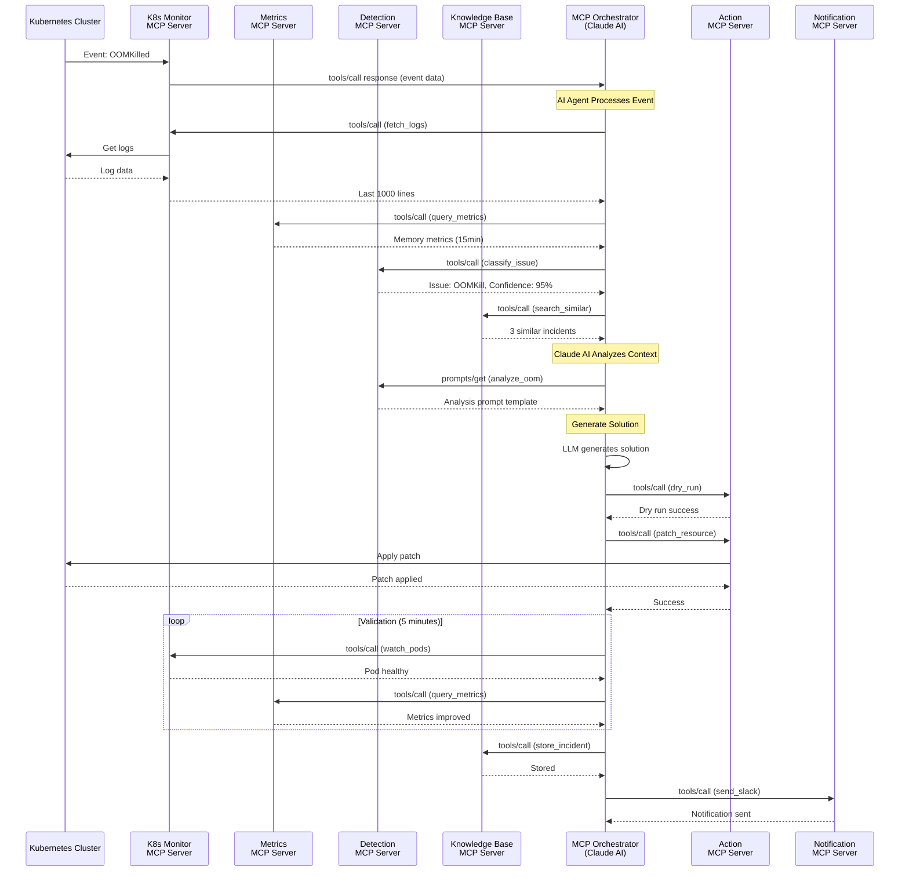
```mermaid
sequenceDiagram
    participant K8s as Kubernetes Cluster
    participant Mon as K8s Monitor<br/>MCP Server
    participant Met as Metrics<br/>MCP Server
    participant Det as Detection<br/>MCP Server
    participant KB as Knowledge Base<br/>MCP Server
    participant Orch as MCP Orchestrator<br/>(Claude AI)
    participant Act as Action<br/>MCP Server
    participant Not as Notification<br/>MCP Server
    
    K8s->>Mon: Event: OOMKilled
    Mon->>Orch: tools/call response (event data)
    
    Note over Orch: AI Agent Processes Event
    
    Orch->>Mon: tools/call (fetch_logs)
    Mon->>K8s: Get logs
    K8s-->>Mon: Log data
    Mon-->>Orch: Last 1000 lines
    
    Orch->>Met: tools/call (query_metrics)
    Met-->>Orch: Memory metrics (15min)
    
    Orch->>Det: tools/call (classify_issue)
    Det-->>Orch: Issue: OOMKill, Confidence: 95%
    
    Orch->>KB: tools/call (search_similar)
    KB-->>Orch: 3 similar incidents
    
    Note over Orch: Claude AI Analyzes Context
    Orch->>Det: prompts/get (analyze_oom)
    Det-->>Orch: Analysis prompt template
    
    Note over Orch: Generate Solution
    Orch->>Orch: LLM generates solution
    
    Orch->>Act: tools/call (dry_run)
    Act-->>Orch: Dry run success
    
    Orch->>Act: tools/call (patch_resource)
    Act->>K8s: Apply patch
    K8s-->>Act: Patch applied
    Act-->>Orch: Success
    
    loop Validation (5 minutes)
        Orch->>Mon: tools/call (watch_pods)
        Mon-->>Orch: Pod healthy
        Orch->>Met: tools/call (query_metrics)
        Met-->>Orch: Metrics improved
    end
    
    Orch->>KB: tools/call (store_incident)
    KB-->>Orch: Stored
    
    Orch->>Not: tools/call (send_slack)
    Not-->>Orch: Notification sent
```

---

## MCP Server Interaction Workflows

### K8s Monitor MCP Server Workflow

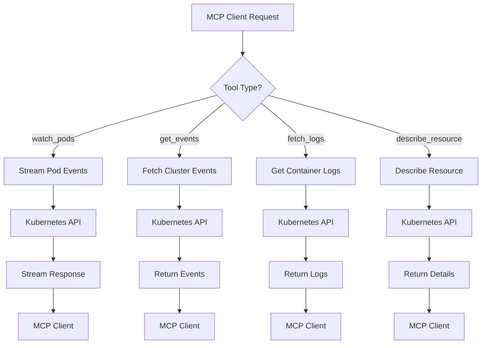
```mermaid
flowchart TD
    Start[MCP Client Request] --> ToolType{Tool Type?}
    
    ToolType -->|watch_pods| WatchPods[Stream Pod Events]
    ToolType -->|get_events| GetEvents[Fetch Cluster Events]
    ToolType -->|fetch_logs| FetchLogs[Get Container Logs]
    ToolType -->|describe_resource| Describe[Describe Resource]
    
    WatchPods --> K8sAPI1[Kubernetes API]
    GetEvents --> K8sAPI2[Kubernetes API]
    FetchLogs --> K8sAPI3[Kubernetes API]
    Describe --> K8sAPI4[Kubernetes API]
    
    K8sAPI1 --> Stream[Stream Response]
    K8sAPI2 --> Return1[Return Events]
    K8sAPI3 --> Return2[Return Logs]
    K8sAPI4 --> Return3[Return Details]
    
    Stream --> Client1[MCP Client]
    Return1 --> Client2[MCP Client]
    Return2 --> Client3[MCP Client]
    Return3 --> Client4[MCP Client]
```

### Metrics MCP Server Workflow

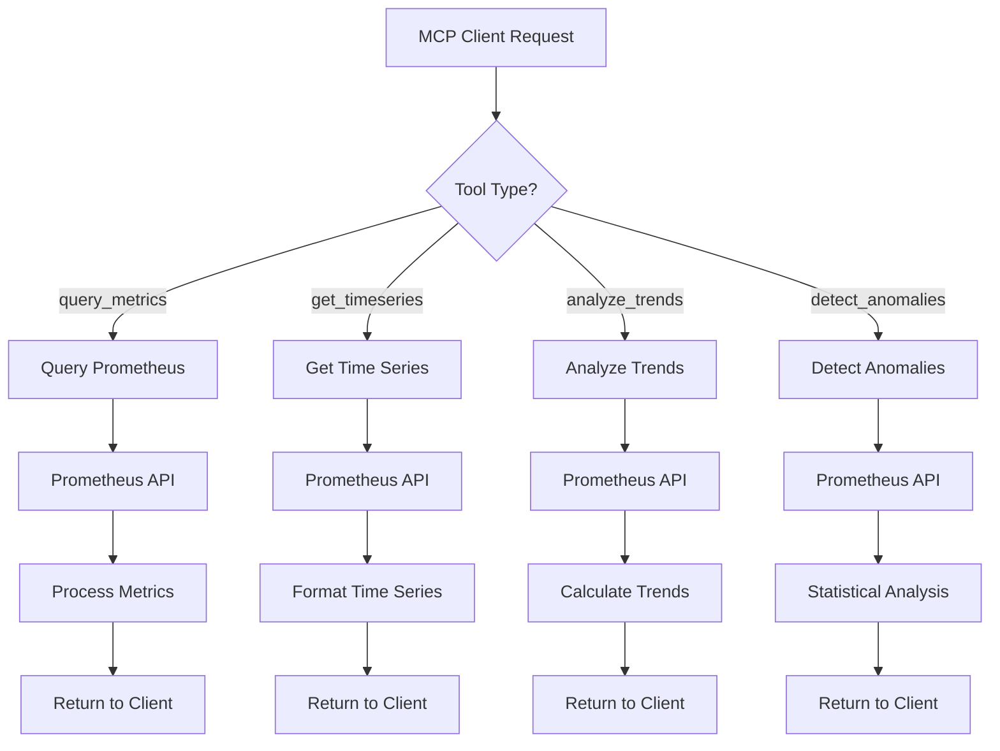
```mermaid
flowchart TD
    Start[MCP Client Request] --> ToolType{Tool Type?}
    
    ToolType -->|query_metrics| Query[Query Prometheus]
    ToolType -->|get_timeseries| TimeSeries[Get Time Series]
    ToolType -->|analyze_trends| Trends[Analyze Trends]
    ToolType -->|detect_anomalies| Anomalies[Detect Anomalies]
    
    Query --> Prom1[Prometheus API]
    TimeSeries --> Prom2[Prometheus API]
    Trends --> Prom3[Prometheus API]
    Anomalies --> Prom4[Prometheus API]
    
    Prom1 --> Process1[Process Metrics]
    Prom2 --> Process2[Format Time Series]
    Prom3 --> Process3[Calculate Trends]
    Prom4 --> Process4[Statistical Analysis]
    
    Process1 --> Return1[Return to Client]
    Process2 --> Return2[Return to Client]
    Process3 --> Return3[Return to Client]
    Process4 --> Return4[Return to Client]
```

### Detection MCP Server Workflow

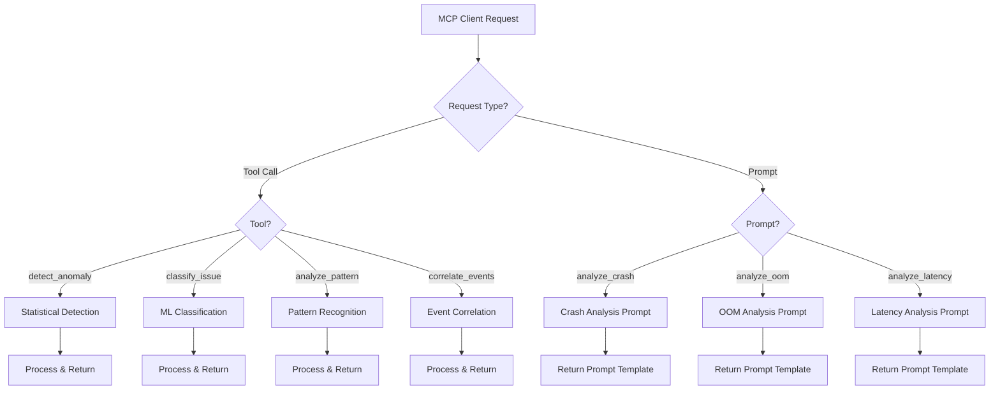
```mermaid
flowchart TD
    Start[MCP Client Request] --> Type{Request Type?}
    
    Type -->|Tool Call| ToolType{Tool?}
    Type -->|Prompt| PromptType{Prompt?}
    
    ToolType -->|detect_anomaly| DetectAnom[Statistical Detection]
    ToolType -->|classify_issue| Classify[ML Classification]
    ToolType -->|analyze_pattern| Pattern[Pattern Recognition]
    ToolType -->|correlate_events| Correlate[Event Correlation]
    
    PromptType -->|analyze_crash| CrashPrompt[Crash Analysis Prompt]
    PromptType -->|analyze_oom| OOMPrompt[OOM Analysis Prompt]
    PromptType -->|analyze_latency| LatencyPrompt[Latency Analysis Prompt]
    
    DetectAnom --> Process1[Process & Return]
    Classify --> Process2[Process & Return]
    Pattern --> Process3[Process & Return]
    Correlate --> Process4[Process & Return]
    
    CrashPrompt --> Template1[Return Prompt Template]
    OOMPrompt --> Template2[Return Prompt Template]
    LatencyPrompt --> Template3[Return Prompt Template]
```

### Action MCP Server Workflow

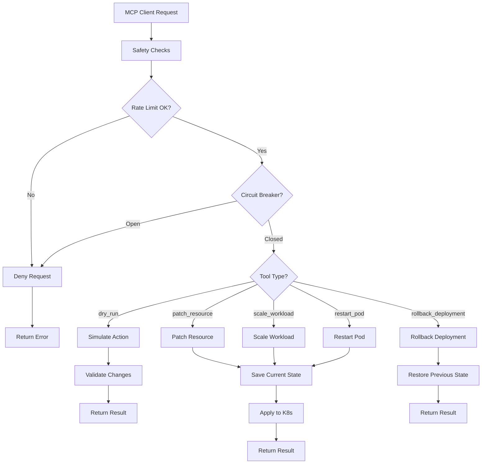
```mermaid
flowchart TD
    Start[MCP Client Request] --> Safety[Safety Checks]
    
    Safety --> RateLimit{Rate Limit OK?}
    RateLimit -->|No| Deny[Deny Request]
    RateLimit -->|Yes| CircuitBreaker{Circuit Breaker?}
    
    CircuitBreaker -->|Open| Deny
    CircuitBreaker -->|Closed| ToolType{Tool Type?}
    
    ToolType -->|dry_run| DryRun[Simulate Action]
    ToolType -->|patch_resource| Patch[Patch Resource]
    ToolType -->|scale_workload| Scale[Scale Workload]
    ToolType -->|restart_pod| Restart[Restart Pod]
    ToolType -->|rollback_deployment| Rollback[Rollback Deployment]
    
    DryRun --> Validate1[Validate Changes]
    Patch --> SaveState[Save Current State]
    Scale --> SaveState
    Restart --> SaveState
    Rollback --> RestoreState[Restore Previous State]
    
    Validate1 --> Return1[Return Result]
    SaveState --> Apply[Apply to K8s]
    Apply --> Return2[Return Result]
    RestoreState --> Return3[Return Result]
    
    Deny --> Return4[Return Error]
```

---

## Issue Detection Workflow

### MCP-Based Anomaly Detection

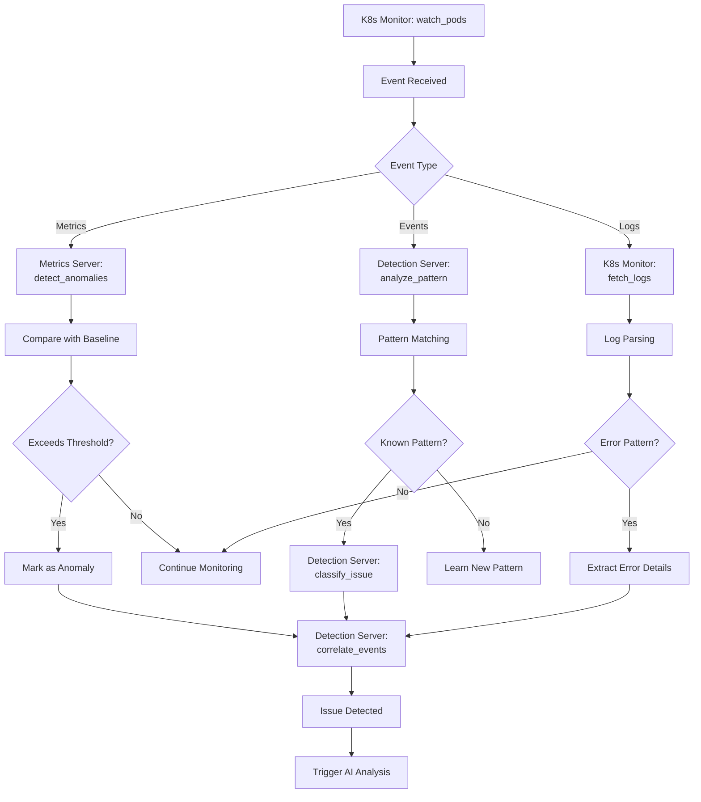
```mermaid
flowchart TD
    Start[K8s Monitor: watch_pods] --> Event[Event Received]
    Event --> Type{Event Type}
    
    Type -->|Metrics| CallMetrics[Metrics Server:<br/>detect_anomalies]
    Type -->|Events| CallDetect[Detection Server:<br/>analyze_pattern]
    Type -->|Logs| CallLogs[K8s Monitor:<br/>fetch_logs]
    
    CallMetrics --> Baseline[Compare with Baseline]
    CallDetect --> Pattern[Pattern Matching]
    CallLogs --> Parse[Log Parsing]
    
    Baseline --> Threshold{Exceeds Threshold?}
    Pattern --> Known{Known Pattern?}
    Parse --> Error{Error Pattern?}
    
    Threshold -->|Yes| Anomaly[Mark as Anomaly]
    Threshold -->|No| Continue[Continue Monitoring]
    
    Known -->|Yes| Classify[Detection Server:<br/>classify_issue]
    Known -->|No| Learn[Learn New Pattern]
    
    Error -->|Yes| Extract[Extract Error Details]
    Error -->|No| Continue
    
    Anomaly --> Correlate[Detection Server:<br/>correlate_events]
    Classify --> Correlate
    Extract --> Correlate
    
    Correlate --> IssueDetected[Issue Detected]
    IssueDetected --> TriggerAnalysis[Trigger AI Analysis]
```

### MCP Issue Classification

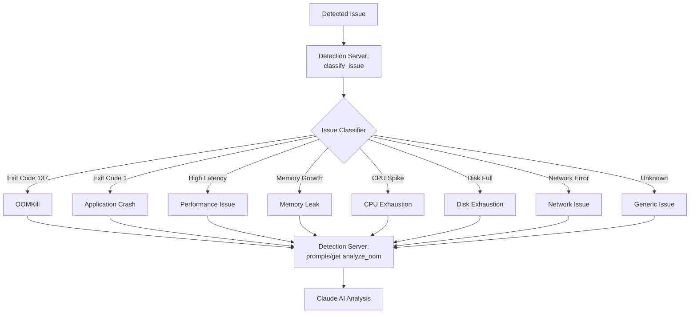
```mermaid
graph TD
    Issue[Detected Issue] --> CallClassifier[Detection Server:<br/>classify_issue]
    
    CallClassifier --> Classifier{Issue Classifier}
    
    Classifier -->|Exit Code 137| OOM[OOMKill]
    Classifier -->|Exit Code 1| Crash[Application Crash]
    Classifier -->|High Latency| Latency[Performance Issue]
    Classifier -->|Memory Growth| MemLeak[Memory Leak]
    Classifier -->|CPU Spike| CPU[CPU Exhaustion]
    Classifier -->|Disk Full| Disk[Disk Exhaustion]
    Classifier -->|Network Error| Network[Network Issue]
    Classifier -->|Unknown| Generic[Generic Issue]
    
    OOM --> GetPrompt[Detection Server:<br/>prompts/get analyze_oom]
    Crash --> GetPrompt
    Latency --> GetPrompt
    MemLeak --> GetPrompt
    CPU --> GetPrompt
    Disk --> GetPrompt
    Network --> GetPrompt
    Generic --> GetPrompt
    
    GetPrompt --> AIAnalysis[Claude AI Analysis]
```

---

## AI Analysis Workflow

### MCP Context Enrichment Process

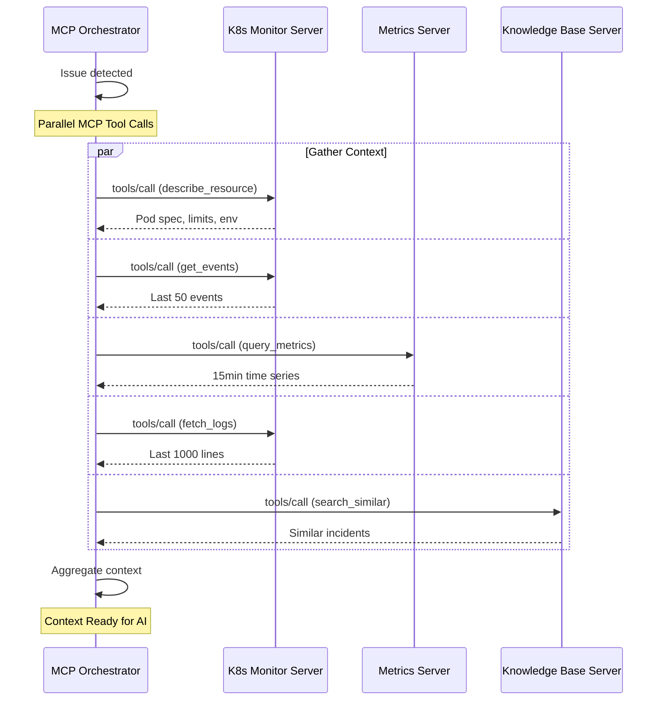
```mermaid
sequenceDiagram
    participant Orch as MCP Orchestrator
    participant Mon as K8s Monitor Server
    participant Met as Metrics Server
    participant KB as Knowledge Base Server
    
    Orch->>Orch: Issue detected
    
    Note over Orch: Parallel MCP Tool Calls
    
    par Gather Context
        Orch->>Mon: tools/call (describe_resource)
        Mon-->>Orch: Pod spec, limits, env
    and
        Orch->>Mon: tools/call (get_events)
        Mon-->>Orch: Last 50 events
    and
        Orch->>Met: tools/call (query_metrics)
        Met-->>Orch: 15min time series
    and
        Orch->>Mon: tools/call (fetch_logs)
        Mon-->>Orch: Last 1000 lines
    and
        Orch->>KB: tools/call (search_similar)
        KB-->>Orch: Similar incidents
    end
    
    Orch->>Orch: Aggregate context
    Note over Orch: Context Ready for AI
```

### MCP-Based LLM Analysis Process

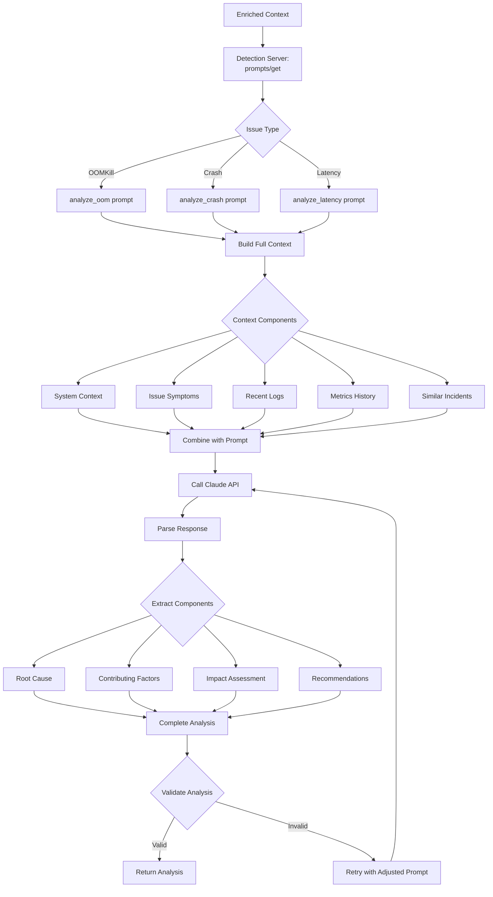
```mermaid
flowchart TD
    Start[Enriched Context] --> GetPrompt[Detection Server:<br/>prompts/get]
    
    GetPrompt --> PromptType{Issue Type}
    PromptType -->|OOMKill| OOMPrompt[analyze_oom prompt]
    PromptType -->|Crash| CrashPrompt[analyze_crash prompt]
    PromptType -->|Latency| LatencyPrompt[analyze_latency prompt]
    
    OOMPrompt --> BuildContext[Build Full Context]
    CrashPrompt --> BuildContext
    LatencyPrompt --> BuildContext
    
    BuildContext --> Components{Context Components}
    Components --> SystemContext[System Context]
    Components --> IssueSymptoms[Issue Symptoms]
    Components --> Logs[Recent Logs]
    Components --> Metrics[Metrics History]
    Components --> History[Similar Incidents]
    
    SystemContext --> CombinePrompt[Combine with Prompt]
    IssueSymptoms --> CombinePrompt
    Logs --> CombinePrompt
    Metrics --> CombinePrompt
    History --> CombinePrompt
    
    CombinePrompt --> LLMCall[Call Claude API]
    LLMCall --> ParseResponse[Parse Response]
    
    ParseResponse --> Extract{Extract Components}
    Extract --> RootCause[Root Cause]
    Extract --> Contributing[Contributing Factors]
    Extract --> Impact[Impact Assessment]
    Extract --> Recommendations[Recommendations]
    
    RootCause --> Analysis[Complete Analysis]
    Contributing --> Analysis
    Impact --> Analysis
    Recommendations --> Analysis
    
    Analysis --> Validate{Validate Analysis}
    Validate -->|Valid| Return[Return Analysis]
    Validate -->|Invalid| Retry[Retry with Adjusted Prompt]
    Retry --> LLMCall
```

### MCP Solution Generation Workflow

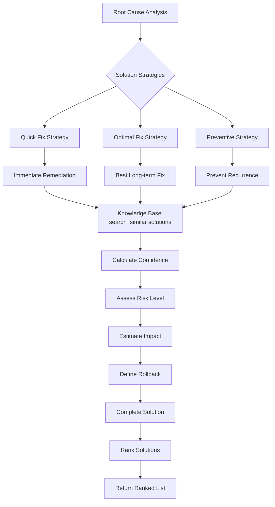
```mermaid
graph TD
    Analysis[Root Cause Analysis] --> Strategies{Solution Strategies}
    
    Strategies --> Quick[Quick Fix Strategy]
    Strategies --> Optimal[Optimal Fix Strategy]
    Strategies --> Preventive[Preventive Strategy]
    
    Quick --> QuickSolution[Immediate Remediation]
    Optimal --> OptimalSolution[Best Long-term Fix]
    Preventive --> PreventiveSolution[Prevent Recurrence]
    
    QuickSolution --> CheckKB[Knowledge Base:<br/>search_similar solutions]
    OptimalSolution --> CheckKB
    PreventiveSolution --> CheckKB
    
    CheckKB --> Score[Calculate Confidence]
    Score --> Risk[Assess Risk Level]
    Risk --> Impact[Estimate Impact]
    Impact --> Rollback[Define Rollback]
    
    Rollback --> Solution[Complete Solution]
    Solution --> Rank[Rank Solutions]
    Rank --> Return[Return Ranked List]
```

---

## Decision & Action Workflow

### MCP Auto-Fix Decision Process

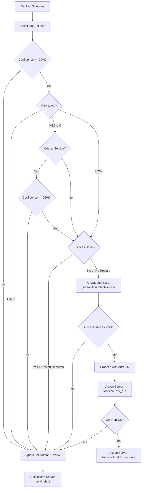
```mermaid
flowchart TD
    Solutions[Ranked Solutions] --> TopSolution[Select Top Solution]
    
    TopSolution --> CheckConfidence{Confidence >= 90%?}
    CheckConfidence -->|No| HumanReview[Queue for Human Review]
    CheckConfidence -->|Yes| CheckRisk{Risk Level?}
    
    CheckRisk -->|HIGH| HumanReview
    CheckRisk -->|MEDIUM| CheckCritical{Critical Service?}
    CheckRisk -->|LOW| CheckTime{Business Hours?}
    
    CheckCritical -->|Yes| CheckHighConfidence{Confidence >= 95%?}
    CheckCritical -->|No| CheckTime
    
    CheckHighConfidence -->|No| HumanReview
    CheckHighConfidence -->|Yes| CheckTime
    
    CheckTime -->|Yes + Restart Required| HumanReview
    CheckTime -->|No or No Restart| CheckHistory[Knowledge Base:<br/>get solution effectiveness]
    
    CheckHistory --> HistSuccess{Success Rate >= 85%?}
    HistSuccess -->|No| HumanReview
    HistSuccess -->|Yes| AutoFix[Proceed with Auto-Fix]
    
    AutoFix --> DryRun[Action Server:<br/>tools/call dry_run]
    DryRun --> DrySuccess{Dry Run OK?}
    
    DrySuccess -->|No| HumanReview
    DrySuccess -->|Yes| Execute[Action Server:<br/>tools/call patch_resource]
    
    HumanReview --> Notify[Notification Server:<br/>send_slack]
```

### MCP Action Execution Workflow

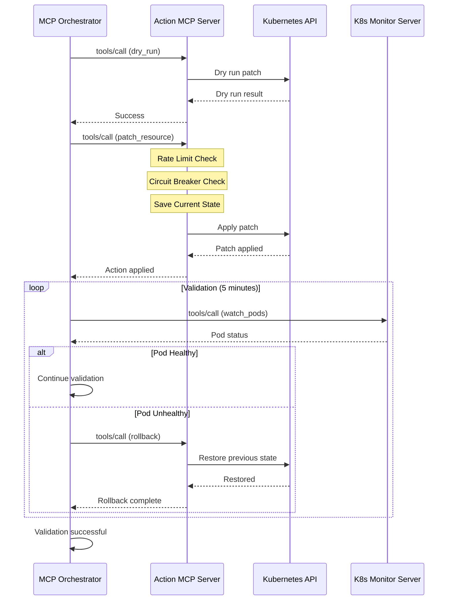
```mermaid
sequenceDiagram
    participant Orch as MCP Orchestrator
    participant Act as Action MCP Server
    participant K8s as Kubernetes API
    participant Mon as K8s Monitor Server
    
    Orch->>Act: tools/call (dry_run)
    Act->>K8s: Dry run patch
    K8s-->>Act: Dry run result
    Act-->>Orch: Success
    
    Orch->>Act: tools/call (patch_resource)
    
    Note over Act: Rate Limit Check
    Note over Act: Circuit Breaker Check
    Note over Act: Save Current State
    
    Act->>K8s: Apply patch
    K8s-->>Act: Patch applied
    Act-->>Orch: Action applied
    
    loop Validation (5 minutes)
        Orch->>Mon: tools/call (watch_pods)
        Mon-->>Orch: Pod status
        
        alt Pod Healthy
            Orch->>Orch: Continue validation
        else Pod Unhealthy
            Orch->>Act: tools/call (rollback)
            Act->>K8s: Restore previous state
            K8s-->>Act: Restored
            Act-->>Orch: Rollback complete
        end
    end
    
    Orch->>Orch: Validation successful
```

---

## Validation & Rollback Workflow

### MCP Validation Process

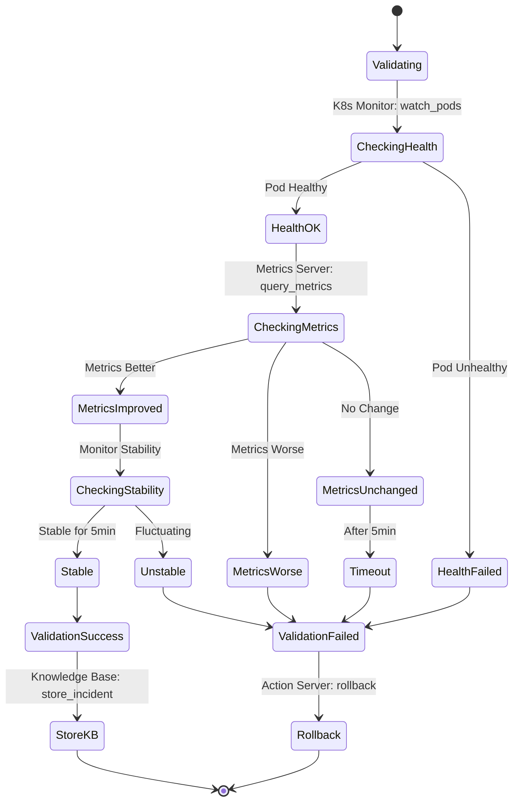
```mermaid
stateDiagram-v2
    [*] --> Validating
    
    Validating --> CheckingHealth: K8s Monitor: watch_pods
    CheckingHealth --> HealthOK: Pod Healthy
    CheckingHealth --> HealthFailed: Pod Unhealthy
    
    HealthOK --> CheckingMetrics: Metrics Server: query_metrics
    CheckingMetrics --> MetricsImproved: Metrics Better
    CheckingMetrics --> MetricsWorse: Metrics Worse
    CheckingMetrics --> MetricsUnchanged: No Change
    
    MetricsImproved --> CheckingStability: Monitor Stability
    CheckingStability --> Stable: Stable for 5min
    CheckingStability --> Unstable: Fluctuating
    
    Stable --> ValidationSuccess
    ValidationSuccess --> StoreKB: Knowledge Base: store_incident
    StoreKB --> [*]
    
    HealthFailed --> ValidationFailed
    MetricsWorse --> ValidationFailed
    Unstable --> ValidationFailed
    MetricsUnchanged --> Timeout: After 5min
    Timeout --> ValidationFailed
    
    ValidationFailed --> Rollback: Action Server: rollback
    Rollback --> [*]
```

### MCP Rollback Process

```mermaid
flowchart TD
    Start[Validation Failed] --> CallRollback[Action Server:<br/>tools/call rollback]
    CallRollback --> GetState[Retrieve Saved State]
    GetState --> CheckState{State Available?}
    
    CheckState -->|No| Manual[Manual Intervention Required]
    CheckState -->|Yes| ApplyRollback[Apply Rollback to K8s]
    
    ApplyRollback --> WaitComplete[Wait for Completion]
    WaitComplete --> VerifyRollback[K8s Monitor:<br/>watch_pods]
    
    VerifyRollback --> Success{Rollback Successful?}
    Success -->|Yes| NotifySuccess[Notification Server:<br/>send_slack]
    Success -->|No| NotifyFailure[Notification Server:<br/>send_slack (failure)]
    
    NotifySuccess --> UpdateKB[Knowledge Base:<br/>update_effectiveness]
    NotifyFailure --> Manual
    
    UpdateKB --> End[End]
    Manual --> End
```

---

## Learning & Feedback Workflow

### MCP Knowledge Base Update Process

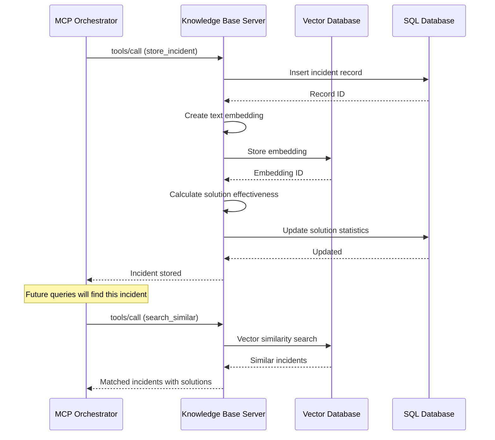
```mermaid
sequenceDiagram
    participant Orch as MCP Orchestrator
    participant KB as Knowledge Base Server
    participant VDB as Vector Database
    participant SQL as SQL Database
    
    Orch->>KB: tools/call (store_incident)
    
    KB->>SQL: Insert incident record
    SQL-->>KB: Record ID
    
    KB->>KB: Create text embedding
    KB->>VDB: Store embedding
    VDB-->>KB: Embedding ID
    
    KB->>KB: Calculate solution effectiveness
    KB->>SQL: Update solution statistics
    SQL-->>KB: Updated
    
    KB-->>Orch: Incident stored
    
    Note over Orch: Future queries will find this incident
    
    Orch->>KB: tools/call (search_similar)
    KB->>VDB: Vector similarity search
    VDB-->>KB: Similar incidents
    KB-->>Orch: Matched incidents with solutions
```

### MCP Continuous Learning Loop

```mermaid
graph TD
    Start[New Incident Resolved] --> Store[Knowledge Base:<br/>store_incident]
    
    Store --> Analyze[Analyze Outcome]
    Analyze --> Success{Successful?}
    
    Success -->|Yes| UpdateSuccess[Knowledge Base:<br/>update_effectiveness (success)]
    Success -->|No| UpdateFailure[Knowledge Base:<br/>update_effectiveness (failure)]
    
    UpdateSuccess --> AdjustConfidence[Adjust Confidence Model]
    UpdateFailure --> AdjustConfidence
    
    AdjustConfidence --> UpdateThresholds[Update Detection Thresholds]
    UpdateThresholds --> ImproveRanking[Improve Solution Ranking]
    
    ImproveRanking --> TrainModels[Retrain ML Models]
    TrainModels --> Deploy[Deploy Updated Models]
    
    Deploy --> Monitor[Monitor Performance]
    Monitor --> Feedback{Improvement?}
    
    Feedback -->|Yes| Continue[Continue Learning]
    Feedback -->|No| Investigate[Investigate Issues]
    
    Continue --> Start
    Investigate --> Adjust[Adjust Learning Parameters]
    Adjust --> Start
```

---

## Specific Issue Workflows

### MCP-Based OOMKill Detection & Resolution

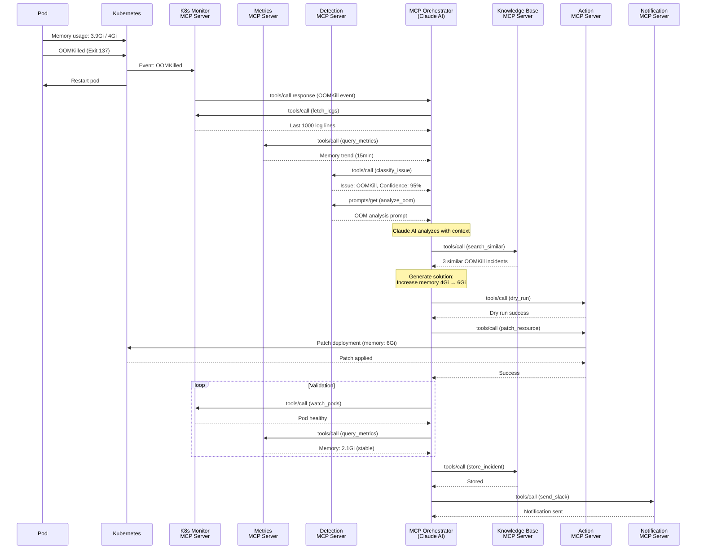
```mermaid
sequenceDiagram
    participant Pod as Pod
    participant K8s as Kubernetes
    participant Mon as K8s Monitor<br/>MCP Server
    participant Met as Metrics<br/>MCP Server
    participant Det as Detection<br/>MCP Server
    participant Orch as MCP Orchestrator<br/>(Claude AI)
    participant KB as Knowledge Base<br/>MCP Server
    participant Act as Action<br/>MCP Server
    participant Not as Notification<br/>MCP Server
    
    Pod->>K8s: Memory usage: 3.9Gi / 4Gi
    Pod->>K8s: OOMKilled (Exit 137)
    K8s->>Mon: Event: OOMKilled
    K8s->>Pod: Restart pod
    
    Mon->>Orch: tools/call response (OOMKill event)
    
    Orch->>Mon: tools/call (fetch_logs)
    Mon-->>Orch: Last 1000 log lines
    
    Orch->>Met: tools/call (query_metrics)
    Met-->>Orch: Memory trend (15min)
    
    Orch->>Det: tools/call (classify_issue)
    Det-->>Orch: Issue: OOMKill, Confidence: 95%
    
    Orch->>Det: prompts/get (analyze_oom)
    Det-->>Orch: OOM analysis prompt
    
    Note over Orch: Claude AI analyzes with context
    
    Orch->>KB: tools/call (search_similar)
    KB-->>Orch: 3 similar OOMKill incidents
    
    Note over Orch: Generate solution:<br/>Increase memory 4Gi → 6Gi
    
    Orch->>Act: tools/call (dry_run)
    Act-->>Orch: Dry run success
    
    Orch->>Act: tools/call (patch_resource)
    Act->>K8s: Patch deployment (memory: 6Gi)
    K8s-->>Act: Patch applied
    Act-->>Orch: Success
    
    loop Validation
        Orch->>Mon: tools/call (watch_pods)
        Mon-->>Orch: Pod healthy
        Orch->>Met: tools/call (query_metrics)
        Met-->>Orch: Memory: 2.1Gi (stable)
    end
    
    Orch->>KB: tools/call (store_incident)
    KB-->>Orch: Stored
    
    Orch->>Not: tools/call (send_slack)
    Not-->>Orch: Notification sent
```

### MCP-Based High Latency Detection & Resolution

```mermaid
flowchart TD
    Start[Metrics Server:<br/>detect_anomalies] --> Measure[Measure p95 latency]
    
    Measure --> Compare{p95 > Baseline * 2?}
    Compare -->|No| Continue[Continue Monitoring]
    Compare -->|Yes| Alert[Trigger Alert]
    
    Alert --> Classify[Detection Server:<br/>classify_issue]
    Classify --> GetPrompt[Detection Server:<br/>prompts/get analyze_latency]
    
    GetPrompt --> Analyze[Claude AI Analysis]
    Analyze --> CheckDB{DB Connection Pool?}
    Analyze --> CheckCPU{CPU Throttling?}
    Analyze --> CheckNetwork{Network Issues?}
    Analyze --> CheckDependency{Slow Dependency?}
    
    CheckDB -->|Yes| SolutionDB[Solution: Increase Pool]
    CheckCPU -->|Yes| SolutionCPU[Solution: Increase CPU]
    CheckNetwork -->|Yes| SolutionNet[Solution: Fix Network]
    CheckDependency -->|Yes| SolutionDep[Solution: Optimize Calls]
    
    SolutionDB --> DryRun[Action Server: dry_run]
    SolutionCPU --> DryRun
    SolutionNet --> DryRun
    SolutionDep --> DryRun
    
    DryRun --> Apply[Action Server: patch_resource]
    Apply --> Validate[Validate Latency]
    Validate --> Success{Latency Normal?}
    
    Success -->|Yes| Store[Knowledge Base: store_incident]
    Success -->|No| Escalate[Escalate to SRE]
    
    Store --> Notify[Notification Server: send_slack]
```

### MCP-Based Memory Leak Detection & Resolution

```mermaid
graph TD
    Start[Metrics Server:<br/>analyze_trends] --> Collect[Collect Memory Metrics]
    Collect --> Analyze[Analyze Growth Pattern]
    
    Analyze --> Linear{Linear Growth?}
    Linear -->|Yes| CalculateRate[Calculate Growth Rate]
    Linear -->|No| Continue[Continue Monitoring]
    
    CalculateRate --> Threshold{Rate > 10%/hour?}
    Threshold -->|No| Continue
    Threshold -->|Yes| Leak[Memory Leak Detected]
    
    Leak --> Classify[Detection Server:<br/>classify_issue]
    Classify --> EstimateTime[Estimate Time to OOM]
    EstimateTime --> Urgent{< 2 hours?}
    
    Urgent -->|Yes| ImmediateAction[Immediate Action Required]
    Urgent -->|No| ScheduledAction[Schedule Action]
    
    ImmediateAction --> Restart[Action Server:<br/>restart_pod]
    ScheduledAction --> Restart
    
    Restart --> EnableProfiling[Enable Memory Profiling]
    EnableProfiling --> Monitor[K8s Monitor:<br/>watch_pods]
    
    Monitor --> LeakPersists{Leak Persists?}
    LeakPersists -->|Yes| CreateTicket[Notification Server:<br/>create_ticket]
    LeakPersists -->|No| Store[Knowledge Base:<br/>store_incident]
    
    CreateTicket --> Store
    Store --> Notify[Notification Server:<br/>send_slack]
```

---

## MCP Workflow Metrics

### Key Performance Indicators

```yaml
Detection Metrics:
  - Mean Time to Detect (MTTD): < 30 seconds
  - False Positive Rate: < 5%
  - Detection Accuracy: > 95%
  - MCP Tool Call Latency: < 100ms

Analysis Metrics:
  - Analysis Duration: < 60 seconds
  - Root Cause Accuracy: > 85%
  - Solution Confidence: Average > 80%
  - MCP Context Enrichment Time: < 5 seconds

Remediation Metrics:
  - Mean Time to Resolution (MTTR): < 5 minutes
  - Auto-Fix Success Rate: > 90%
  - Rollback Rate: < 5%
  - MCP Action Execution Time: < 30 seconds

MCP Server Metrics:
  - Server Availability: > 99.9%
  - Tool Call Success Rate: > 99%
  - Resource Access Latency: < 50ms
  - Prompt Generation Time: < 100ms

Learning Metrics:
  - Knowledge Base Growth: +10% per month
  - Model Accuracy Improvement: +2% per quarter
  - Similar Incident Match Rate: > 80%
  - MCP Server Discovery Time: < 1 second
```

---

## MCP Workflow Best Practices

### 1. MCP Server Design
- Keep tools focused and single-purpose
- Provide clear tool descriptions
- Use JSON schemas for type safety
- Implement proper error handling

### 2. Monitoring
- Use MCP resources for efficient data access
- Implement streaming for real-time data
- Cache frequently accessed resources
- Monitor MCP server health

### 3. Detection
- Leverage MCP prompts for AI guidance
- Combine multiple tool calls for context
- Use correlation tools effectively
- Set appropriate thresholds

### 4. Analysis
- Provide rich context to AI agent
- Use specialized prompts per issue type
- Validate AI responses
- Cache analysis results

### 5. Action
- Always use dry_run before applying
- Implement rate limiting per server
- Use circuit breakers
- Save state before changes

### 6. Validation
- Monitor through MCP tools
- Check multiple indicators
- Have clear success criteria
- Implement automatic rollback

### 7. Learning
- Store all outcomes in Knowledge Base
- Use vector search for similar incidents
- Track solution effectiveness
- Continuously improve prompts

---

## MCP Troubleshooting Workflows

### When MCP Server Fails

```mermaid
flowchart TD
    Issue[MCP Server Not Responding] --> CheckHealth{Server Health?}
    CheckHealth -->|Down| RestartServer[Restart MCP Server]
    CheckHealth -->|Up| CheckConnection{Connection OK?}
    
    CheckConnection -->|No| FixConnection[Fix Connection]
    CheckConnection -->|Yes| CheckTools{Tools Available?}
    
    CheckTools -->|No| Reinitialize[Reinitialize Server]
    CheckTools -->|Yes| CheckLogs[Check Server Logs]
    
    RestartServer --> Verify[Verify Server]
    FixConnection --> Verify
    Reinitialize --> Verify
    CheckLogs --> Debug[Debug Issue]
```

### When Tool Call Fails

```mermaid
flowchart TD
    Failed[Tool Call Failed] --> CheckError{Error Type?}
    CheckError -->|Timeout| IncreaseTimeout[Increase Timeout]
    CheckError -->|Invalid Params| FixParams[Fix Parameters]
    CheckError -->|Permission| FixRBAC[Fix RBAC]
    CheckError -->|Server Error| CheckServer[Check Server Health]
    
    IncreaseTimeout --> Retry[Retry Tool Call]
    FixParams --> Retry
    FixRBAC --> Retry
    CheckServer --> RestartServer[Restart Server]
    
    RestartServer --> Retry
    Retry --> Success{Success?}
    Success -->|Yes| Continue[Continue Workflow]
    Success -->|No| Fallback[Use Fallback Strategy]
```

---

## Conclusion

These MCP-based workflows provide a comprehensive view of how the AI-Powered Kubernetes SRE Assistant operates using the Model Context Protocol. Each workflow is designed to be:

- **MCP-Native**: Uses MCP protocol for all interactions
- **Modular**: Each MCP server handles specific capabilities
- **AI-Orchestrated**: Claude AI agent coordinates all servers
- **Reliable**: Handles failures gracefully
- **Observable**: Every step is logged and monitored
- **Scalable**: Can handle multiple concurrent issues
- **Safe**: Includes validation and rollback mechanisms
- **Intelligent**: Learns and improves over time

The MCP architecture enables:
- **Discoverability**: AI agent discovers server capabilities
- **Extensibility**: Easy to add new MCP servers
- **Standardization**: Uses standard MCP protocol
- **Type Safety**: JSON schemas ensure correct usage
- **Context-Aware**: Rich context through resources and prompts

The workflows work together to create an autonomous system that can detect, analyze, and resolve most common Kubernetes issues while safely escalating complex problems to human operators.