# Workflow Documentation

## AI-Powered Kubernetes SRE Assistant

This document provides detailed workflow diagrams and explanations for all major processes in the system.

---

## Table of Contents

1. [Overview](#overview)
2. [Complete End-to-End Workflow](#complete-end-to-end-workflow)
3. [Data Collection Workflow](#data-collection-workflow)
4. [Issue Detection Workflow](#issue-detection-workflow)
5. [AI Analysis Workflow](#ai-analysis-workflow)
6. [Decision & Action Workflow](#decision--action-workflow)
7. [Validation & Rollback Workflow](#validation--rollback-workflow)
8. [Learning & Feedback Workflow](#learning--feedback-workflow)
9. [Specific Issue Workflows](#specific-issue-workflows)

---

## Overview

The AI-Powered Kubernetes SRE Assistant operates through a series of interconnected workflows that continuously monitor, analyze, and remediate issues in Kubernetes clusters.

### Workflow Principles

1. **Event-Driven**: Reacts to cluster events in real-time
2. **Asynchronous**: Non-blocking operations for scalability
3. **Idempotent**: Safe to retry operations
4. **Observable**: Every step is logged and monitored
5. **Reversible**: All actions can be rolled back

---

## Complete End-to-End Workflow

### High-Level Flow Diagram

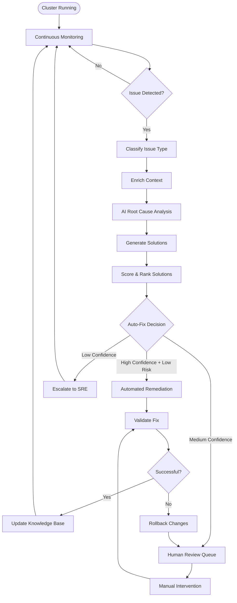
```mermaid
graph TB
    Start([Cluster Running]) --> Monitor[Continuous Monitoring]
    Monitor --> Detect{Issue Detected?}
    Detect -->|No| Monitor
    Detect -->|Yes| Classify[Classify Issue Type]
    
    Classify --> Enrich[Enrich Context]
    Enrich --> Analyze[AI Root Cause Analysis]
    Analyze --> Generate[Generate Solutions]
    Generate --> Score[Score & Rank Solutions]
    
    Score --> Decide{Auto-Fix Decision}
    Decide -->|High Confidence + Low Risk| AutoFix[Automated Remediation]
    Decide -->|Medium Confidence| Review[Human Review Queue]
    Decide -->|Low Confidence| Escalate[Escalate to SRE]
    
    AutoFix --> Validate[Validate Fix]
    Review --> Manual[Manual Intervention]
    Manual --> Validate
    
    Validate --> Success{Successful?}
    Success -->|Yes| Learn[Update Knowledge Base]
    Success -->|No| Rollback[Rollback Changes]
    
    Rollback --> Review
    Learn --> Monitor
    Escalate --> Monitor
```

### Detailed Sequence Diagram

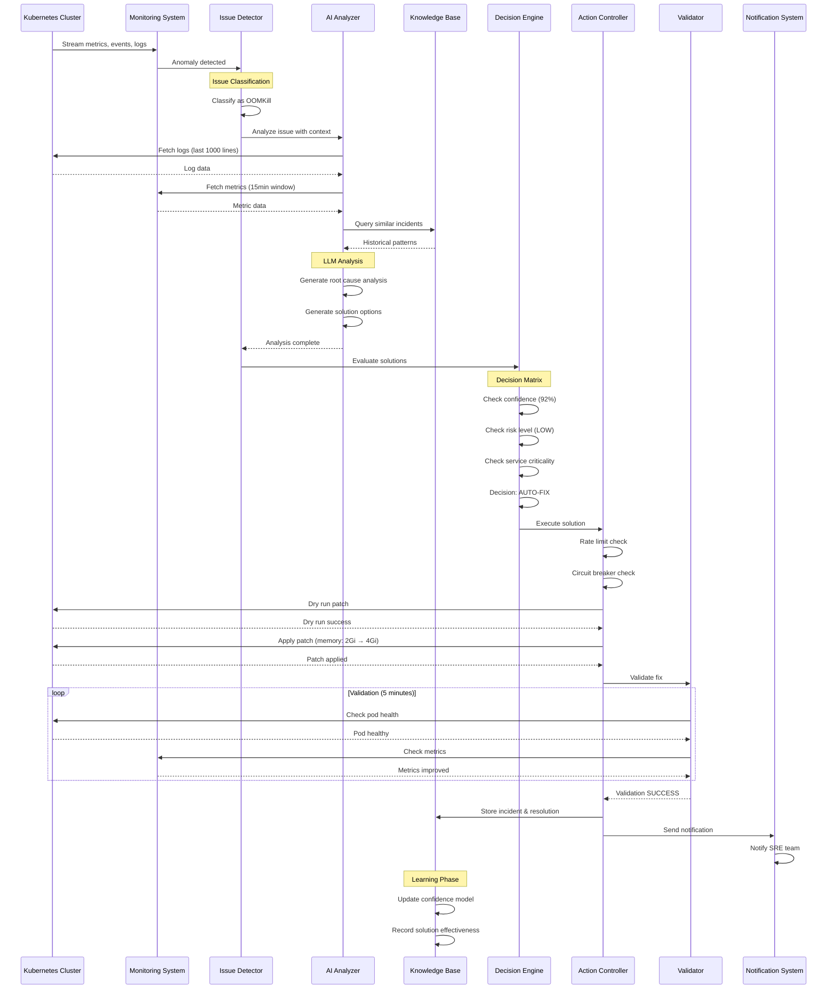
```mermaid
sequenceDiagram
    participant K8s as Kubernetes Cluster
    participant Mon as Monitoring System
    participant Det as Issue Detector
    participant AI as AI Analyzer
    participant KB as Knowledge Base
    participant Dec as Decision Engine
    participant Act as Action Controller
    participant Val as Validator
    participant Not as Notification System
    
    K8s->>Mon: Stream metrics, events, logs
    Mon->>Det: Anomaly detected
    
    Note over Det: Issue Classification
    Det->>Det: Classify as OOMKill
    
    Det->>AI: Analyze issue with context
    AI->>K8s: Fetch logs (last 1000 lines)
    K8s-->>AI: Log data
    AI->>Mon: Fetch metrics (15min window)
    Mon-->>AI: Metric data
    AI->>KB: Query similar incidents
    KB-->>AI: Historical patterns
    
    Note over AI: LLM Analysis
    AI->>AI: Generate root cause analysis
    AI->>AI: Generate solution options
    
    AI-->>Det: Analysis complete
    Det->>Dec: Evaluate solutions
    
    Note over Dec: Decision Matrix
    Dec->>Dec: Check confidence (92%)
    Dec->>Dec: Check risk level (LOW)
    Dec->>Dec: Check service criticality
    Dec->>Dec: Decision: AUTO-FIX
    
    Dec->>Act: Execute solution
    Act->>Act: Rate limit check
    Act->>Act: Circuit breaker check
    Act->>K8s: Dry run patch
    K8s-->>Act: Dry run success
    
    Act->>K8s: Apply patch (memory: 2Gi → 4Gi)
    K8s-->>Act: Patch applied
    
    Act->>Val: Validate fix
    loop Validation (5 minutes)
        Val->>K8s: Check pod health
        K8s-->>Val: Pod healthy
        Val->>Mon: Check metrics
        Mon-->>Val: Metrics improved
    end
    
    Val-->>Act: Validation SUCCESS
    Act->>KB: Store incident & resolution
    Act->>Not: Send notification
    Not->>Not: Notify SRE team
    
    Note over KB: Learning Phase
    KB->>KB: Update confidence model
    KB->>KB: Record solution effectiveness
```

---

## Data Collection Workflow

### Continuous Monitoring Process

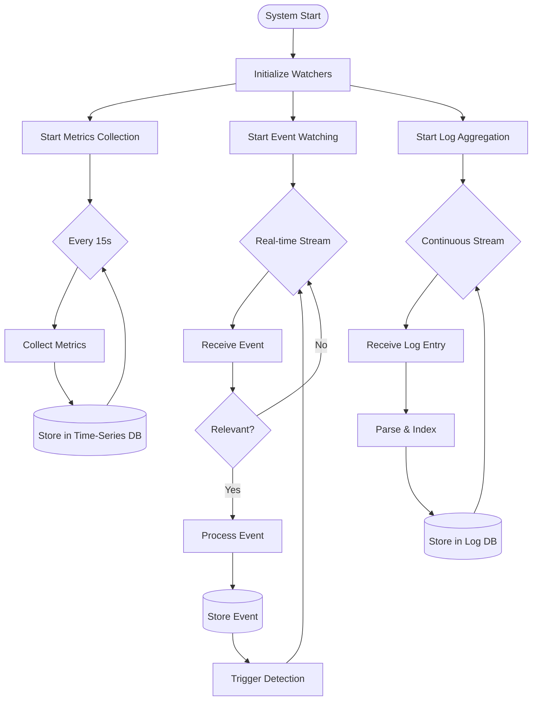
```mermaid
flowchart TD
    Start([System Start]) --> InitWatchers[Initialize Watchers]
    InitWatchers --> StartMetrics[Start Metrics Collection]
    InitWatchers --> StartEvents[Start Event Watching]
    InitWatchers --> StartLogs[Start Log Aggregation]
    
    StartMetrics --> MetricsLoop{Every 15s}
    MetricsLoop --> CollectMetrics[Collect Metrics]
    CollectMetrics --> StoreMetrics[(Store in Time-Series DB)]
    StoreMetrics --> MetricsLoop
    
    StartEvents --> EventStream{Real-time Stream}
    EventStream --> ReceiveEvent[Receive Event]
    ReceiveEvent --> FilterEvent{Relevant?}
    FilterEvent -->|Yes| ProcessEvent[Process Event]
    FilterEvent -->|No| EventStream
    ProcessEvent --> StoreEvent[(Store Event)]
    StoreEvent --> TriggerDetection[Trigger Detection]
    TriggerDetection --> EventStream
    
    StartLogs --> LogStream{Continuous Stream}
    LogStream --> ReceiveLog[Receive Log Entry]
    ReceiveLog --> ParseLog[Parse & Index]
    ParseLog --> StoreLog[(Store in Log DB)]
    StoreLog --> LogStream
```

### Metrics Collection Details

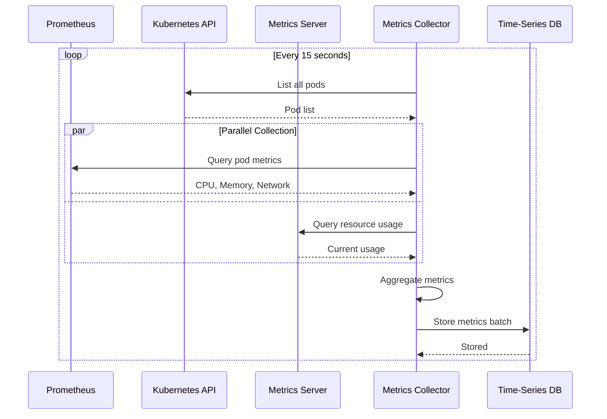
```mermaid
sequenceDiagram
    participant Prom as Prometheus
    participant K8s as Kubernetes API
    participant MS as Metrics Server
    participant Collector as Metrics Collector
    participant TSDB as Time-Series DB
    
    loop Every 15 seconds
        Collector->>K8s: List all pods
        K8s-->>Collector: Pod list
        
        par Parallel Collection
            Collector->>Prom: Query pod metrics
            Prom-->>Collector: CPU, Memory, Network
        and
            Collector->>MS: Query resource usage
            MS-->>Collector: Current usage
        end
        
        Collector->>Collector: Aggregate metrics
        Collector->>TSDB: Store metrics batch
        TSDB-->>Collector: Stored
    end
```

### Event Watching Details

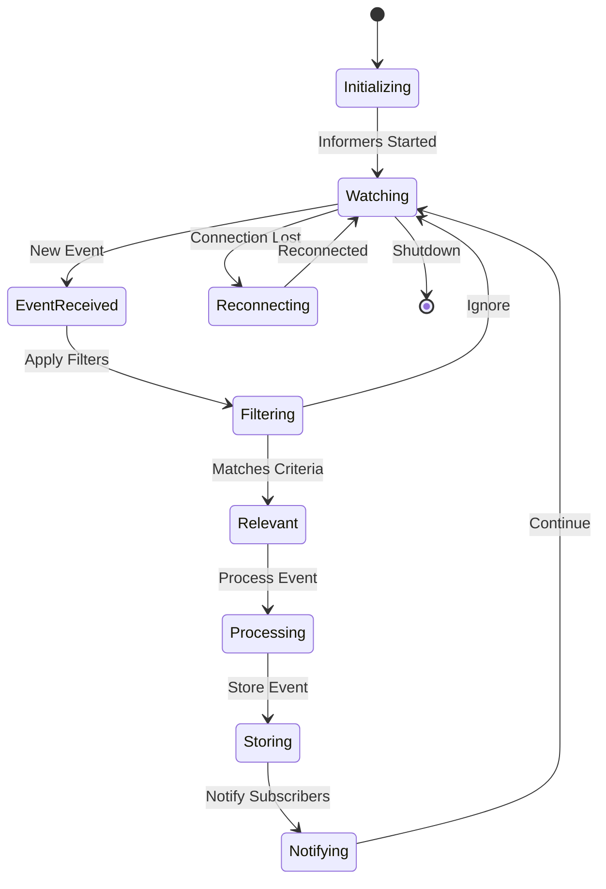
```mermaid
stateDiagram-v2
    [*] --> Initializing
    Initializing --> Watching: Informers Started
    
    Watching --> EventReceived: New Event
    EventReceived --> Filtering: Apply Filters
    
    Filtering --> Relevant: Matches Criteria
    Filtering --> Watching: Ignore
    
    Relevant --> Processing: Process Event
    Processing --> Storing: Store Event
    Storing --> Notifying: Notify Subscribers
    Notifying --> Watching: Continue
    
    Watching --> Reconnecting: Connection Lost
    Reconnecting --> Watching: Reconnected
    
    Watching --> [*]: Shutdown
```

---

## Issue Detection Workflow

### Anomaly Detection Process

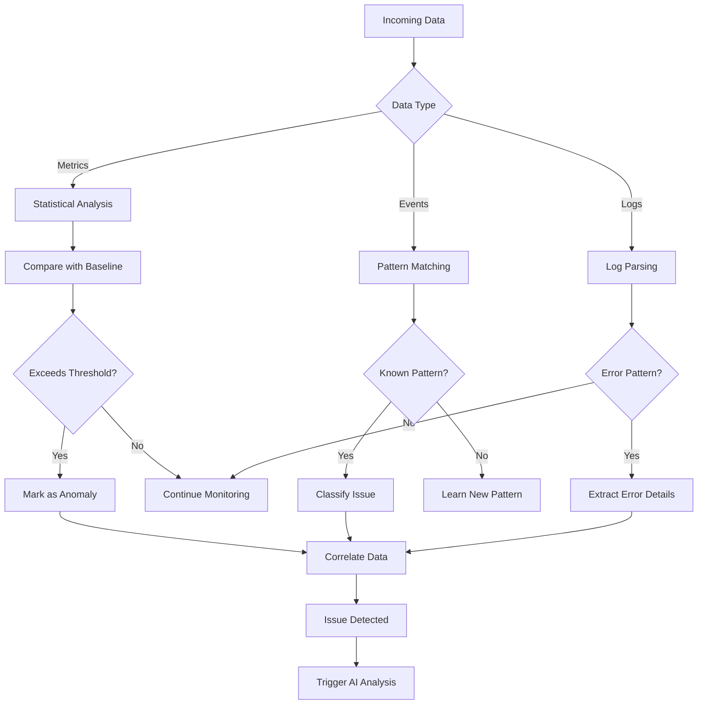
```mermaid
flowchart TD
    Start[Incoming Data] --> Type{Data Type}
    
    Type -->|Metrics| MetricAnalysis[Statistical Analysis]
    Type -->|Events| EventAnalysis[Pattern Matching]
    Type -->|Logs| LogAnalysis[Log Parsing]
    
    MetricAnalysis --> Baseline[Compare with Baseline]
    Baseline --> Threshold{Exceeds Threshold?}
    Threshold -->|Yes| Anomaly[Mark as Anomaly]
    Threshold -->|No| Normal[Continue Monitoring]
    
    EventAnalysis --> Pattern{Known Pattern?}
    Pattern -->|Yes| Classify[Classify Issue]
    Pattern -->|No| Learn[Learn New Pattern]
    
    LogAnalysis --> ErrorDetect{Error Pattern?}
    ErrorDetect -->|Yes| Extract[Extract Error Details]
    ErrorDetect -->|No| Normal
    
    Anomaly --> Correlate[Correlate Data]
    Classify --> Correlate
    Extract --> Correlate
    
    Correlate --> IssueDetected[Issue Detected]
    IssueDetected --> TriggerAnalysis[Trigger AI Analysis]
```

### Issue Classification

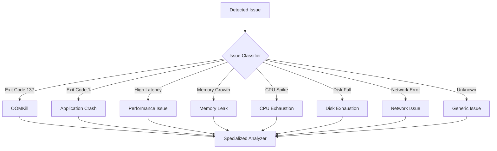
```mermaid
graph TD
    Issue[Detected Issue] --> Classifier{Issue Classifier}
    
    Classifier -->|Exit Code 137| OOM[OOMKill]
    Classifier -->|Exit Code 1| Crash[Application Crash]
    Classifier -->|High Latency| Latency[Performance Issue]
    Classifier -->|Memory Growth| MemLeak[Memory Leak]
    Classifier -->|CPU Spike| CPU[CPU Exhaustion]
    Classifier -->|Disk Full| Disk[Disk Exhaustion]
    Classifier -->|Network Error| Network[Network Issue]
    Classifier -->|Unknown| Generic[Generic Issue]
    
    OOM --> SpecializedAnalyzer[Specialized Analyzer]
    Crash --> SpecializedAnalyzer
    Latency --> SpecializedAnalyzer
    MemLeak --> SpecializedAnalyzer
    CPU --> SpecializedAnalyzer
    Disk --> SpecializedAnalyzer
    Network --> SpecializedAnalyzer
    Generic --> SpecializedAnalyzer
```

---

## AI Analysis Workflow

### Context Enrichment Process

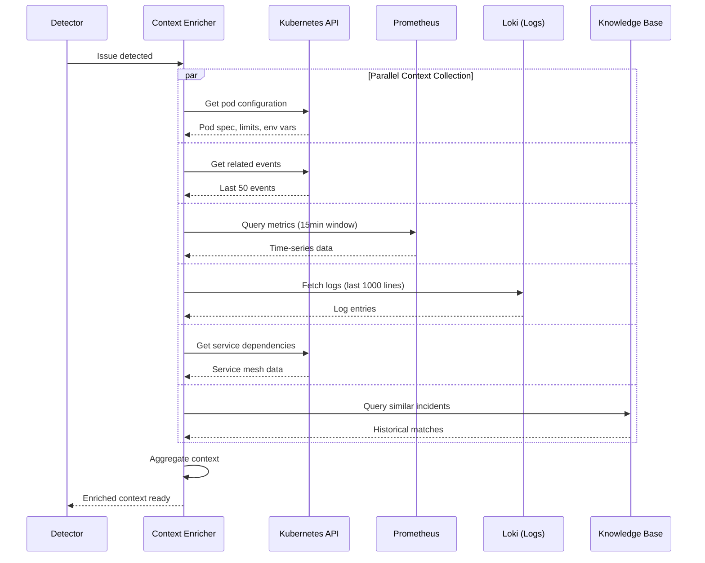
```mermaid
sequenceDiagram
    participant Det as Detector
    participant Enrich as Context Enricher
    participant K8s as Kubernetes API
    participant Prom as Prometheus
    participant Loki as Loki (Logs)
    participant KB as Knowledge Base
    
    Det->>Enrich: Issue detected
    
    par Parallel Context Collection
        Enrich->>K8s: Get pod configuration
        K8s-->>Enrich: Pod spec, limits, env vars
    and
        Enrich->>K8s: Get related events
        K8s-->>Enrich: Last 50 events
    and
        Enrich->>Prom: Query metrics (15min window)
        Prom-->>Enrich: Time-series data
    and
        Enrich->>Loki: Fetch logs (last 1000 lines)
        Loki-->>Enrich: Log entries
    and
        Enrich->>K8s: Get service dependencies
        K8s-->>Enrich: Service mesh data
    and
        Enrich->>KB: Query similar incidents
        KB-->>Enrich: Historical matches
    end
    
    Enrich->>Enrich: Aggregate context
    Enrich-->>Det: Enriched context ready
```

### LLM Analysis Process

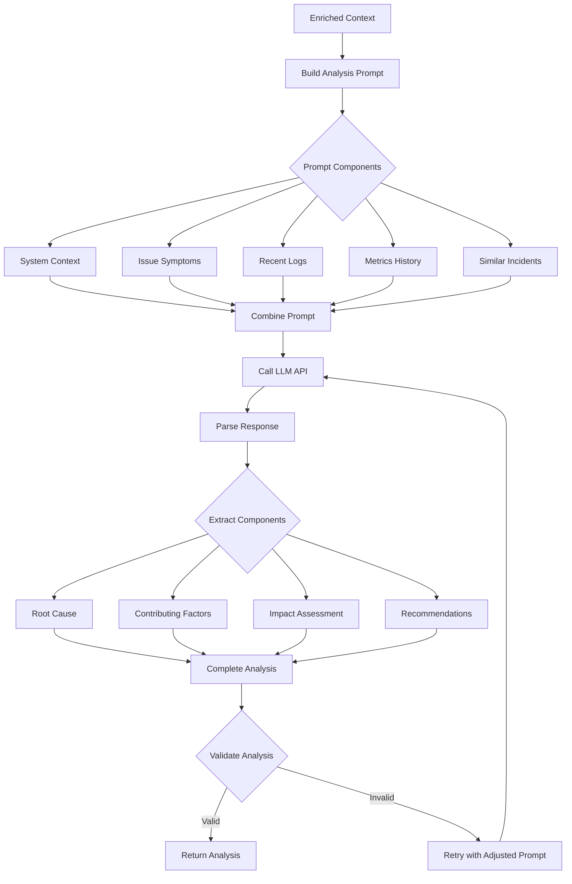
```mermaid
flowchart TD
    Start[Enriched Context] --> BuildPrompt[Build Analysis Prompt]
    
    BuildPrompt --> PromptStructure{Prompt Components}
    PromptStructure --> SystemContext[System Context]
    PromptStructure --> IssueSymptoms[Issue Symptoms]
    PromptStructure --> Logs[Recent Logs]
    PromptStructure --> Metrics[Metrics History]
    PromptStructure --> History[Similar Incidents]
    
    SystemContext --> CombinePrompt[Combine Prompt]
    IssueSymptoms --> CombinePrompt
    Logs --> CombinePrompt
    Metrics --> CombinePrompt
    History --> CombinePrompt
    
    CombinePrompt --> LLMCall[Call LLM API]
    LLMCall --> ParseResponse[Parse Response]
    
    ParseResponse --> Extract{Extract Components}
    Extract --> RootCause[Root Cause]
    Extract --> Contributing[Contributing Factors]
    Extract --> Impact[Impact Assessment]
    Extract --> Recommendations[Recommendations]
    
    RootCause --> Analysis[Complete Analysis]
    Contributing --> Analysis
    Impact --> Analysis
    Recommendations --> Analysis
    
    Analysis --> Validate{Validate Analysis}
    Validate -->|Valid| Return[Return Analysis]
    Validate -->|Invalid| Retry[Retry with Adjusted Prompt]
    Retry --> LLMCall
```

### Solution Generation Workflow

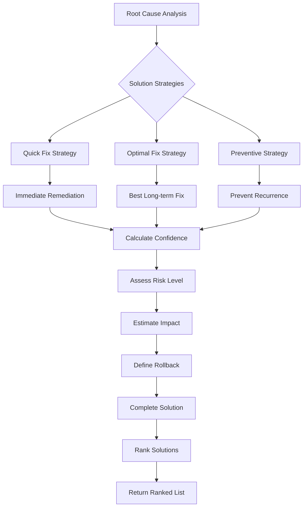
```mermaid
graph TD
    Analysis[Root Cause Analysis] --> Strategies{Solution Strategies}
    
    Strategies --> Quick[Quick Fix Strategy]
    Strategies --> Optimal[Optimal Fix Strategy]
    Strategies --> Preventive[Preventive Strategy]
    
    Quick --> QuickSolution[Immediate Remediation]
    Optimal --> OptimalSolution[Best Long-term Fix]
    Preventive --> PreventiveSolution[Prevent Recurrence]
    
    QuickSolution --> Score[Calculate Confidence]
    OptimalSolution --> Score
    PreventiveSolution --> Score
    
    Score --> Risk[Assess Risk Level]
    Risk --> Impact[Estimate Impact]
    Impact --> Rollback[Define Rollback]
    
    Rollback --> Solution[Complete Solution]
    Solution --> Rank[Rank Solutions]
    Rank --> Return[Return Ranked List]
```

---

## Decision & Action Workflow

### Auto-Fix Decision Process

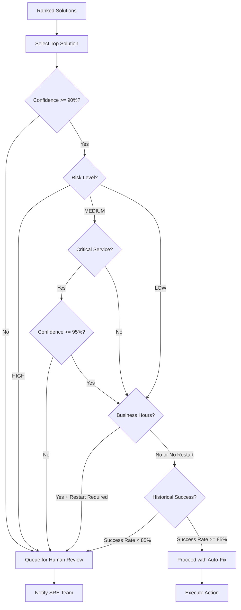
```mermaid
flowchart TD
    Solutions[Ranked Solutions] --> TopSolution[Select Top Solution]
    
    TopSolution --> CheckConfidence{Confidence >= 90%?}
    CheckConfidence -->|No| HumanReview[Queue for Human Review]
    CheckConfidence -->|Yes| CheckRisk{Risk Level?}
    
    CheckRisk -->|HIGH| HumanReview
    CheckRisk -->|MEDIUM| CheckCritical{Critical Service?}
    CheckRisk -->|LOW| CheckTime{Business Hours?}
    
    CheckCritical -->|Yes| CheckHighConfidence{Confidence >= 95%?}
    CheckCritical -->|No| CheckTime
    
    CheckHighConfidence -->|No| HumanReview
    CheckHighConfidence -->|Yes| CheckTime
    
    CheckTime -->|Yes + Restart Required| HumanReview
    CheckTime -->|No or No Restart| CheckHistory{Historical Success?}
    
    CheckHistory -->|Success Rate < 85%| HumanReview
    CheckHistory -->|Success Rate >= 85%| AutoFix[Proceed with Auto-Fix]
    
    AutoFix --> Execute[Execute Action]
    HumanReview --> Notify[Notify SRE Team]
```

### Action Execution Workflow

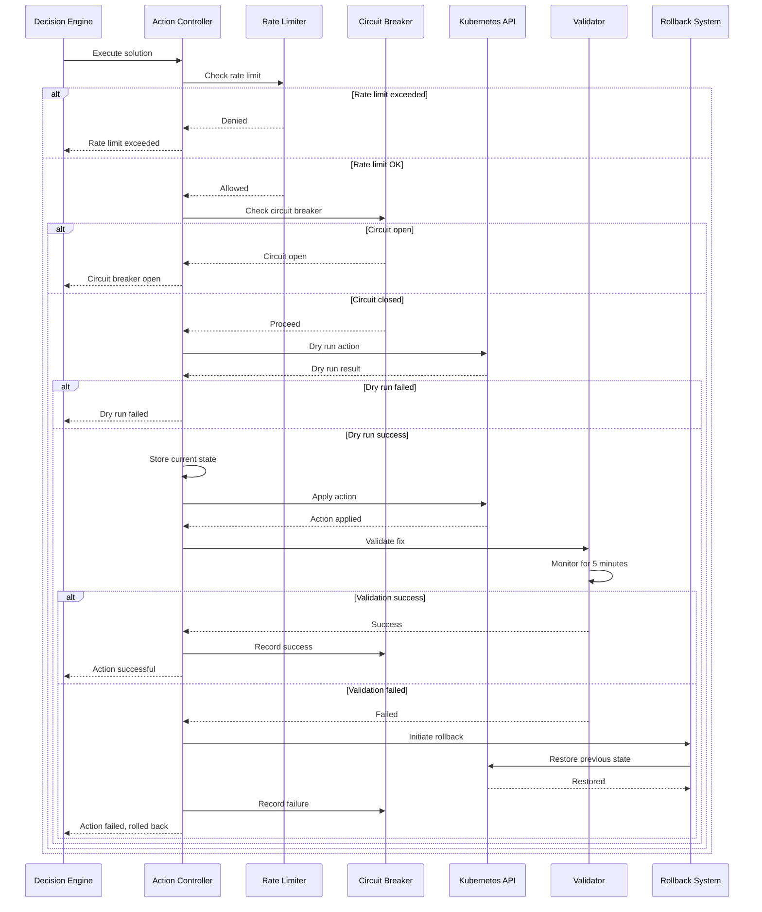
```mermaid
sequenceDiagram
    participant Dec as Decision Engine
    participant Act as Action Controller
    participant RL as Rate Limiter
    participant CB as Circuit Breaker
    participant K8s as Kubernetes API
    participant Val as Validator
    participant RB as Rollback System
    
    Dec->>Act: Execute solution
    
    Act->>RL: Check rate limit
    alt Rate limit exceeded
        RL-->>Act: Denied
        Act-->>Dec: Rate limit exceeded
    else Rate limit OK
        RL-->>Act: Allowed
        
        Act->>CB: Check circuit breaker
        alt Circuit open
            CB-->>Act: Circuit open
            Act-->>Dec: Circuit breaker open
        else Circuit closed
            CB-->>Act: Proceed
            
            Act->>K8s: Dry run action
            K8s-->>Act: Dry run result
            
            alt Dry run failed
                Act-->>Dec: Dry run failed
            else Dry run success
                Act->>Act: Store current state
                Act->>K8s: Apply action
                K8s-->>Act: Action applied
                
                Act->>Val: Validate fix
                Val->>Val: Monitor for 5 minutes
                
                alt Validation success
                    Val-->>Act: Success
                    Act->>CB: Record success
                    Act-->>Dec: Action successful
                else Validation failed
                    Val-->>Act: Failed
                    Act->>RB: Initiate rollback
                    RB->>K8s: Restore previous state
                    K8s-->>RB: Restored
                    Act->>CB: Record failure
                    Act-->>Dec: Action failed, rolled back
                end
            end
        end
    end
```

---

## Validation & Rollback Workflow

### Validation Process

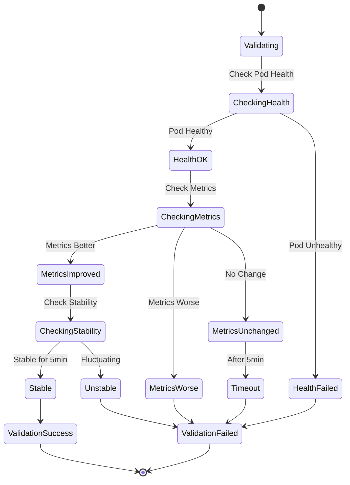
```mermaid
stateDiagram-v2
    [*] --> Validating
    
    Validating --> CheckingHealth: Check Pod Health
    CheckingHealth --> HealthOK: Pod Healthy
    CheckingHealth --> HealthFailed: Pod Unhealthy
    
    HealthOK --> CheckingMetrics: Check Metrics
    CheckingMetrics --> MetricsImproved: Metrics Better
    CheckingMetrics --> MetricsWorse: Metrics Worse
    CheckingMetrics --> MetricsUnchanged: No Change
    
    MetricsImproved --> CheckingStability: Check Stability
    CheckingStability --> Stable: Stable for 5min
    CheckingStability --> Unstable: Fluctuating
    
    Stable --> ValidationSuccess
    ValidationSuccess --> [*]
    
    HealthFailed --> ValidationFailed
    MetricsWorse --> ValidationFailed
    Unstable --> ValidationFailed
    MetricsUnchanged --> Timeout: After 5min
    Timeout --> ValidationFailed
    
    ValidationFailed --> [*]
```

### Rollback Process

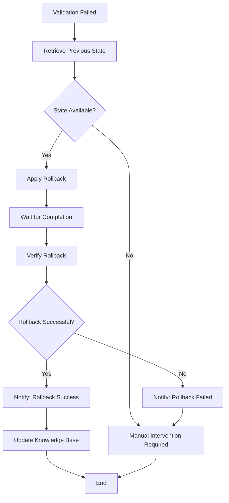
```mermaid
flowchart TD
    Start[Validation Failed] --> GetState[Retrieve Previous State]
    GetState --> CheckState{State Available?}
    
    CheckState -->|No| Manual[Manual Intervention Required]
    CheckState -->|Yes| ApplyRollback[Apply Rollback]
    
    ApplyRollback --> WaitComplete[Wait for Completion]
    WaitComplete --> VerifyRollback[Verify Rollback]
    
    VerifyRollback --> Success{Rollback Successful?}
    Success -->|Yes| NotifySuccess[Notify: Rollback Success]
    Success -->|No| NotifyFailure[Notify: Rollback Failed]
    
    NotifySuccess --> UpdateKB[Update Knowledge Base]
    NotifyFailure --> Manual
    
    UpdateKB --> End[End]
    Manual --> End
```

---

## Learning & Feedback Workflow

### Knowledge Base Update Process

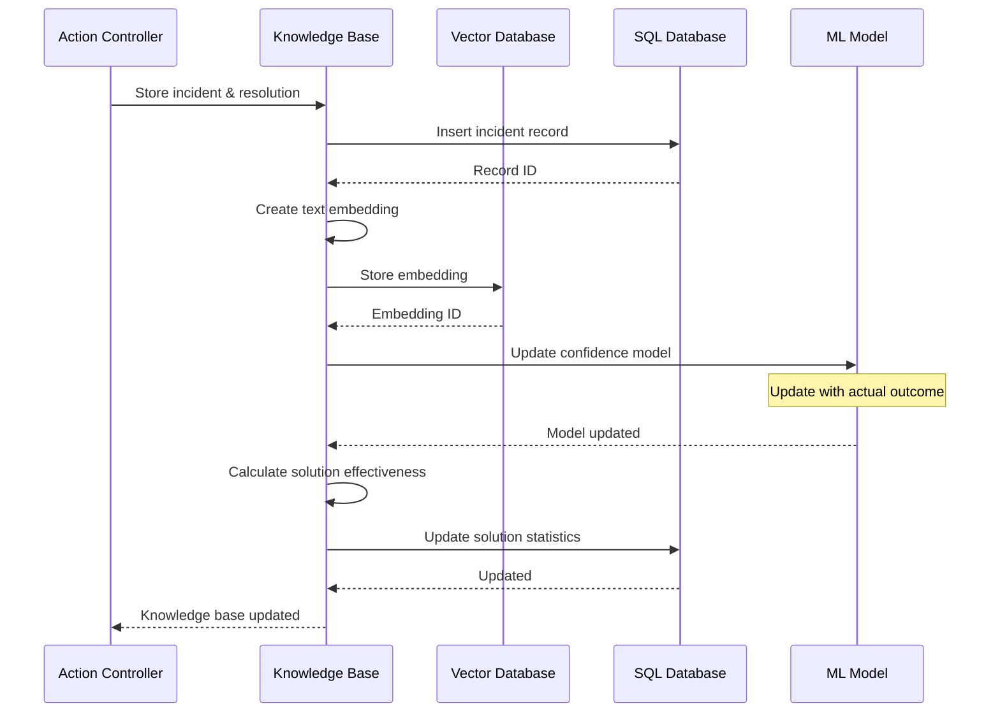
```mermaid
sequenceDiagram
    participant Act as Action Controller
    participant KB as Knowledge Base
    participant VDB as Vector Database
    participant SQL as SQL Database
    participant ML as ML Model
    
    Act->>KB: Store incident & resolution
    
    KB->>SQL: Insert incident record
    SQL-->>KB: Record ID
    
    KB->>KB: Create text embedding
    KB->>VDB: Store embedding
    VDB-->>KB: Embedding ID
    
    KB->>ML: Update confidence model
    Note over ML: Update with actual outcome
    ML-->>KB: Model updated
    
    KB->>KB: Calculate solution effectiveness
    KB->>SQL: Update solution statistics
    SQL-->>KB: Updated
    
    KB-->>Act: Knowledge base updated
```

### Continuous Learning Loop

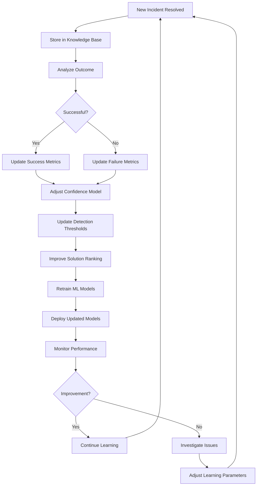
```mermaid
graph TD
    Start[New Incident Resolved] --> Store[Store in Knowledge Base]
    
    Store --> Analyze[Analyze Outcome]
    Analyze --> Success{Successful?}
    
    Success -->|Yes| UpdateSuccess[Update Success Metrics]
    Success -->|No| UpdateFailure[Update Failure Metrics]
    
    UpdateSuccess --> AdjustConfidence[Adjust Confidence Model]
    UpdateFailure --> AdjustConfidence
    
    AdjustConfidence --> UpdateThresholds[Update Detection Thresholds]
    UpdateThresholds --> ImproveRanking[Improve Solution Ranking]
    
    ImproveRanking --> TrainModels[Retrain ML Models]
    TrainModels --> Deploy[Deploy Updated Models]
    
    Deploy --> Monitor[Monitor Performance]
    Monitor --> Feedback{Improvement?}
    
    Feedback -->|Yes| Continue[Continue Learning]
    Feedback -->|No| Investigate[Investigate Issues]
    
    Continue --> Start
    Investigate --> Adjust[Adjust Learning Parameters]
    Adjust --> Start
```

---

## Specific Issue Workflows

### OOMKill Detection & Resolution

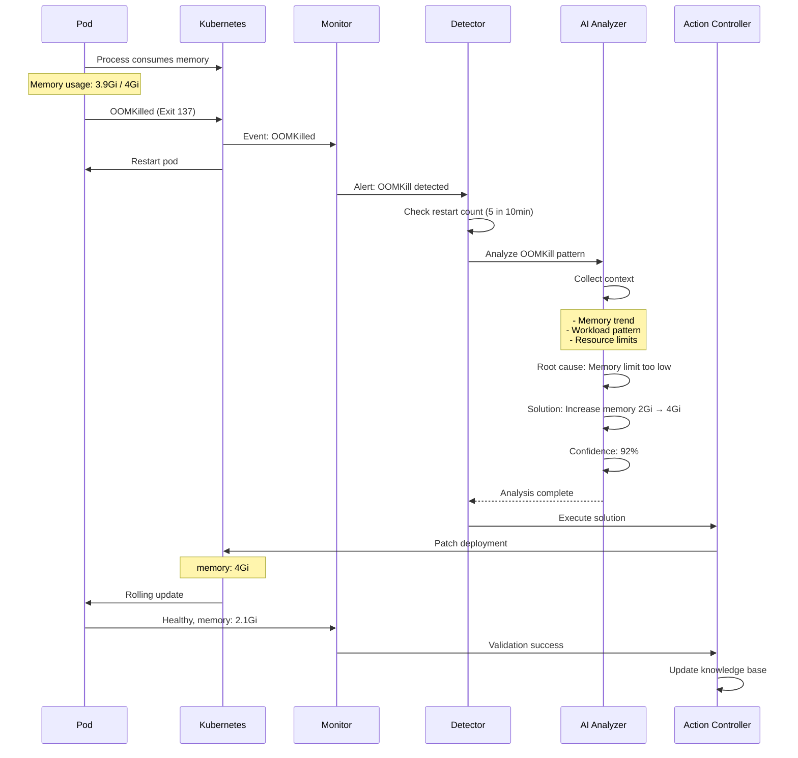
```mermaid
sequenceDiagram
    participant Pod as Pod
    participant K8s as Kubernetes
    participant Mon as Monitor
    participant Det as Detector
    participant AI as AI Analyzer
    participant Act as Action Controller
    
    Pod->>K8s: Process consumes memory
    Note over Pod: Memory usage: 3.9Gi / 4Gi
    
    Pod->>K8s: OOMKilled (Exit 137)
    K8s->>Mon: Event: OOMKilled
    K8s->>Pod: Restart pod
    
    Mon->>Det: Alert: OOMKill detected
    Det->>Det: Check restart count (5 in 10min)
    Det->>AI: Analyze OOMKill pattern
    
    AI->>AI: Collect context
    Note over AI: - Memory trend<br/>- Workload pattern<br/>- Resource limits
    
    AI->>AI: Root cause: Memory limit too low
    AI->>AI: Solution: Increase memory 2Gi → 4Gi
    AI->>AI: Confidence: 92%
    
    AI-->>Det: Analysis complete
    Det->>Act: Execute solution
    
    Act->>K8s: Patch deployment
    Note over K8s: memory: 4Gi
    K8s->>Pod: Rolling update
    
    Pod->>Mon: Healthy, memory: 2.1Gi
    Mon->>Act: Validation success
    Act->>Act: Update knowledge base
```

### High Latency Detection & Resolution

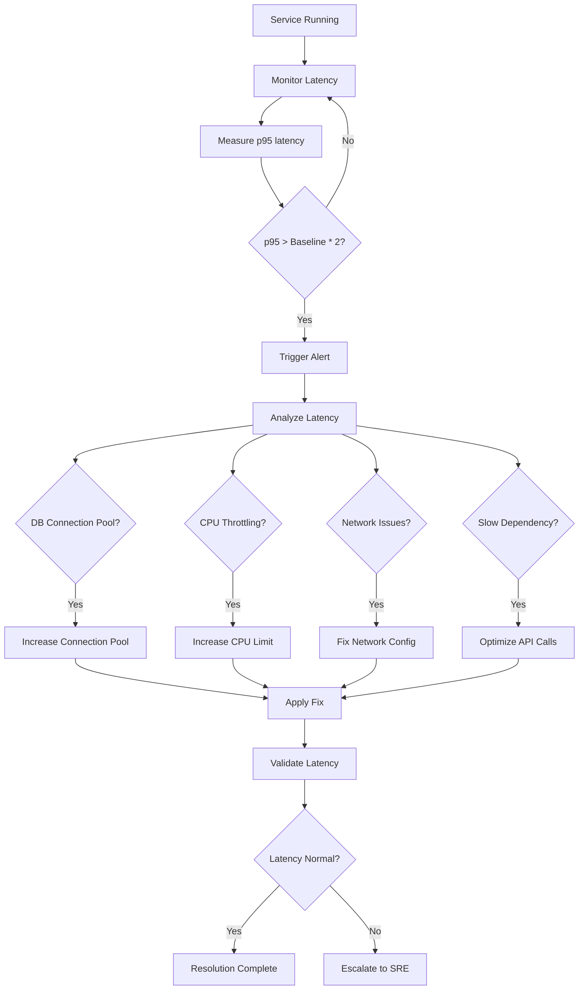
```mermaid
flowchart TD
    Start[Service Running] --> Monitor[Monitor Latency]
    Monitor --> Measure[Measure p95 latency]
    
    Measure --> Compare{p95 > Baseline * 2?}
    Compare -->|No| Monitor
    Compare -->|Yes| Alert[Trigger Alert]
    
    Alert --> Analyze[Analyze Latency]
    Analyze --> CheckDB{DB Connection Pool?}
    Analyze --> CheckCPU{CPU Throttling?}
    Analyze --> CheckNetwork{Network Issues?}
    Analyze --> CheckDependency{Slow Dependency?}
    
    CheckDB -->|Yes| IncreasePool[Increase Connection Pool]
    CheckCPU -->|Yes| IncreaseCPU[Increase CPU Limit]
    CheckNetwork -->|Yes| CheckNetworkConfig[Fix Network Config]
    CheckDependency -->|Yes| OptimizeCalls[Optimize API Calls]
    
    IncreasePool --> Apply[Apply Fix]
    IncreaseCPU --> Apply
    CheckNetworkConfig --> Apply
    OptimizeCalls --> Apply
    
    Apply --> Validate[Validate Latency]
    Validate --> Success{Latency Normal?}
    
    Success -->|Yes| Complete[Resolution Complete]
    Success -->|No| Escalate[Escalate to SRE]
```

### Memory Leak Detection & Resolution

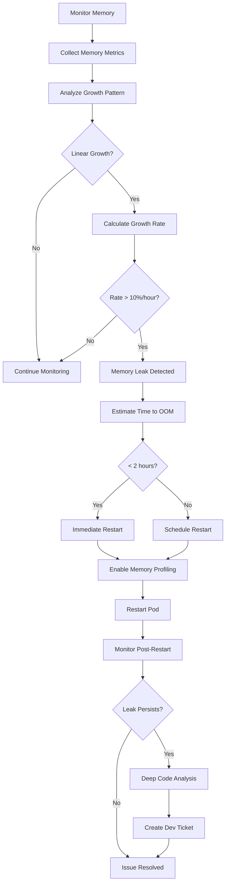
```mermaid
graph TD
    Start[Monitor Memory] --> Collect[Collect Memory Metrics]
    Collect --> Analyze[Analyze Growth Pattern]
    
    Analyze --> Linear{Linear Growth?}
    Linear -->|Yes| CalculateRate[Calculate Growth Rate]
    Linear -->|No| Continue[Continue Monitoring]
    
    CalculateRate --> Threshold{Rate > 10%/hour?}
    Threshold -->|No| Continue
    Threshold -->|Yes| Leak[Memory Leak Detected]
    
    Leak --> EstimateTime[Estimate Time to OOM]
    EstimateTime --> Urgent{< 2 hours?}
    
    Urgent -->|Yes| ImmediateAction[Immediate Restart]
    Urgent -->|No| ScheduledAction[Schedule Restart]
    
    ImmediateAction --> EnableProfiling[Enable Memory Profiling]
    ScheduledAction --> EnableProfiling
    
    EnableProfiling --> Restart[Restart Pod]
    Restart --> Monitor2[Monitor Post-Restart]
    
    Monitor2 --> LeakPersists{Leak Persists?}
    LeakPersists -->|Yes| DeepAnalysis[Deep Code Analysis]
    LeakPersists -->|No| Resolved[Issue Resolved]
    
    DeepAnalysis --> CreateTicket[Create Dev Ticket]
    CreateTicket --> Resolved
```

---

## Workflow Metrics

### Key Performance Indicators

```yaml
Detection Metrics:
  - Mean Time to Detect (MTTD): < 30 seconds
  - False Positive Rate: < 5%
  - Detection Accuracy: > 95%

Analysis Metrics:
  - Analysis Duration: < 60 seconds
  - Root Cause Accuracy: > 85%
  - Solution Confidence: Average > 80%

Remediation Metrics:
  - Mean Time to Resolution (MTTR): < 5 minutes
  - Auto-Fix Success Rate: > 90%
  - Rollback Rate: < 5%

Learning Metrics:
  - Knowledge Base Growth: +10% per month
  - Model Accuracy Improvement: +2% per quarter
  - Similar Incident Match Rate: > 80%
```

---

## Workflow Best Practices

### 1. Monitoring
- Collect metrics at consistent intervals
- Use appropriate retention periods
- Implement efficient querying strategies

### 2. Detection
- Set appropriate thresholds
- Avoid alert fatigue
- Correlate multiple signals

### 3. Analysis
- Provide sufficient context to LLM
- Use structured prompts
- Validate AI responses

### 4. Action
- Always dry-run first
- Implement rate limiting
- Use circuit breakers

### 5. Validation
- Monitor for sufficient duration
- Check multiple indicators
- Have clear success criteria

### 6. Learning
- Store all outcomes
- Regularly retrain models
- Track effectiveness over time

---

## Troubleshooting Workflows

### When Detection Fails

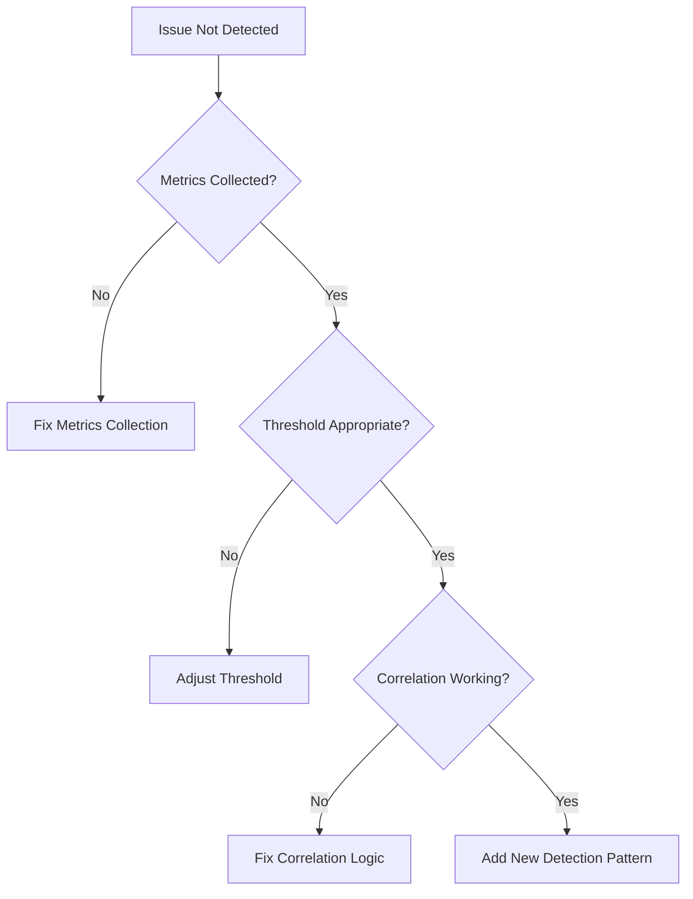
```mermaid
flowchart TD
    Issue[Issue Not Detected] --> CheckMetrics{Metrics Collected?}
    CheckMetrics -->|No| FixCollection[Fix Metrics Collection]
    CheckMetrics -->|Yes| CheckThreshold{Threshold Appropriate?}
    
    CheckThreshold -->|No| AdjustThreshold[Adjust Threshold]
    CheckThreshold -->|Yes| CheckCorrelation{Correlation Working?}
    
    CheckCorrelation -->|No| FixCorrelation[Fix Correlation Logic]
    CheckCorrelation -->|Yes| AddPattern[Add New Detection Pattern]
```

### When Auto-Fix Fails

```mermaid
flowchart TD
    Failed[Auto-Fix Failed] --> CheckValidation{Validation Failed?}
    CheckValidation -->|Yes| Rollback[Automatic Rollback]
    CheckValidation -->|No| CheckApply{Apply Failed?}
    
    CheckApply -->|Yes| CheckPermissions[Check RBAC Permissions]
    CheckApply -->|No| CheckDryRun{Dry Run Failed?}
    
    CheckDryRun -->|Yes| FixConfig[Fix Configuration]
    CheckDryRun -->|No| InvestigateRoot[Investigate Root Cause]
    
    Rollback --> NotifySRE[Notify SRE Team]
    CheckPermissions --> NotifySRE
    FixConfig --> Retry[Retry Action]
    InvestigateRoot --> NotifySRE
```

---

## Conclusion

These workflows provide a comprehensive view of how the AI-Powered Kubernetes SRE Assistant operates. Each workflow is designed to be:

- **Reliable**: Handles failures gracefully
- **Observable**: Every step is logged and monitored
- **Scalable**: Can handle multiple concurrent issues
- **Safe**: Includes validation and rollback mechanisms
- **Intelligent**: Learns and improves over time

The workflows work together to create an autonomous system that can detect, analyze, and resolve most common Kubernetes issues while safely escalating complex problems to human operators.